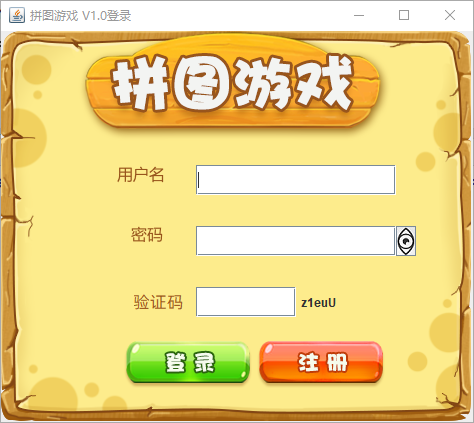
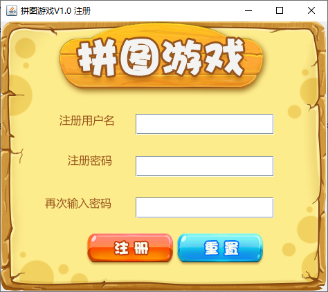
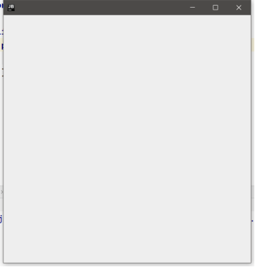
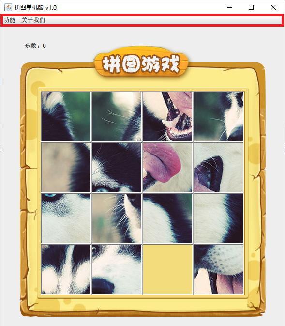
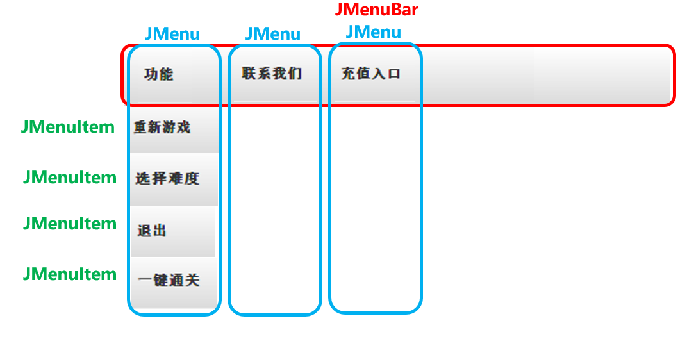
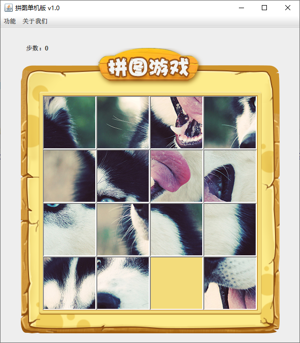
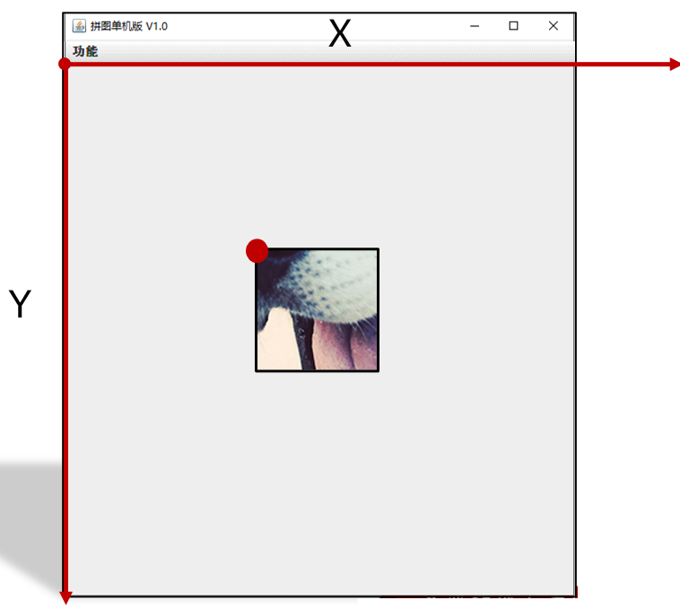
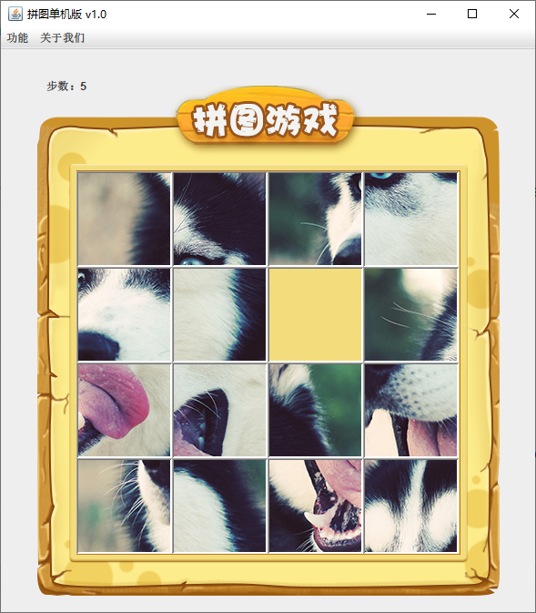
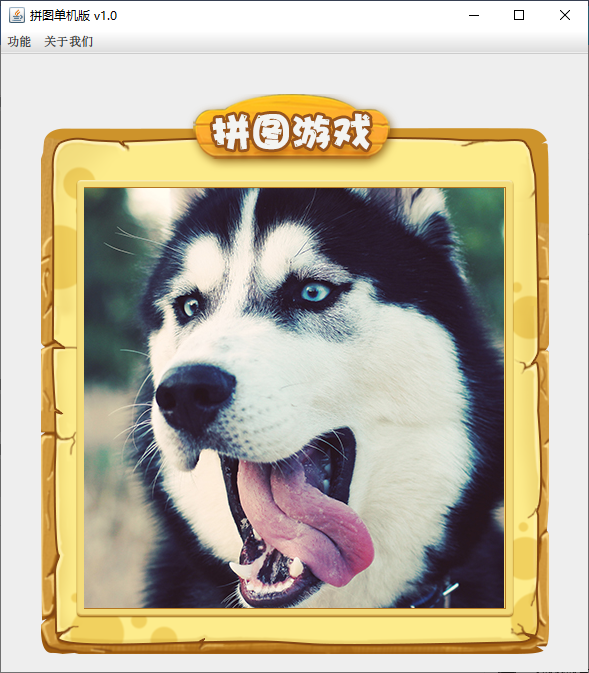

# 面向对象综合练习

## 练习一：文字版格斗游戏 

需求:

​	格斗游戏，每个游戏角色的姓名，血量，都不相同，在选定人物的时候（new对象的时候），这些信息就应该被确定下来。 

举例：

​	程序运行之后结果为：

​	姓名为:乔峰		血量为:100

​	姓名为:鸠摩智	血量为:100

​	乔峰举起拳头打了鸠摩智一下，造成了XX点伤害，鸠摩智还剩下XXX点血。

​	鸠摩智举起拳头打了鸠摩智一下，造成了XX点伤害，乔峰还剩下XXX点血。

​	乔峰举起拳头打了鸠摩智一下，造成了XX点伤害，鸠摩智还剩下XXX点血。

​	鸠摩智举起拳头打了鸠摩智一下，造成了XX点伤害，乔峰还剩下XXX点血。

​	乔峰K.O.了鸠摩智 

代码示例：

```java
public class GameTest {
    public static void main(String[] args) {
        //1.创建第一个角色
        Role r1 = new Role("乔峰",100);
        //2.创建第二个角色
        Role r2 = new Role("鸠摩智",100);

        //3.开始格斗 回合制游戏
        while(true){
            //r1开始攻击r2
            r1.attack(r2);
            //判断r2的剩余血量
            if(r2.getBlood() == 0){
                System.out.println(r1.getName() + " K.O了" + r2.getName());
                break;
            }

            //r2开始攻击r1
            r2.attack(r1);
            if(r1.getBlood() == 0){
                System.out.println(r2.getName() + " K.O了" + r1.getName());
                break;
            }


        }
    }
}


public class Role {
    private String name;
    private int blood;

    public Role() {
    }

    public Role(String name, int blood) {
        this.name = name;
        this.blood = blood;
    }

    public String getName() {
        return name;
    }

    public void setName(String name) {
        this.name = name;
    }

    public int getBlood() {
        return blood;
    }

    public void setBlood(int blood) {
        this.blood = blood;
    }


    //定义一个方法用于攻击别人
    //思考：谁攻击谁？
    //Role r1 = new Role（）；
    //Role r2 = new Role（）；
    //r1.攻击(r2);
    //方法的调用者去攻击参数
    public void attack(Role role) {
        //计算造成的伤害 1 ~ 20
        Random r = new Random();
        int hurt = r.nextInt(20) + 1;

        //剩余血量
        int remainBoold = role.getBlood() - hurt;
        //对剩余血量做一个验证，如果为负数了，就修改为0
        remainBoold = remainBoold < 0 ? 0 : remainBoold;
        //修改一下挨揍的人的血量
        role.setBlood(remainBoold);

        //this表示方法的调用者
        System.out.println(this.getName() + "举起拳头，打了" + role.getName() + "一下，" +
                "造成了" + hurt + "点伤害，" + role.getName() + "还剩下了" + remainBoold + "点血");
    }

}
```

## 练习二：文字版格斗游戏进阶

​	在上一个的基础上，我想看到人物的性别和长相，打斗的时候我想看到武功招式。

举例：

​	程序运行之后结果为：

​	姓名为:乔峰		血量为:100	性别为:男	长相为:气宇轩昂

​	姓名为:鸠摩智	血量为:100	性别为:男	长相为:气宇轩昂

​	乔峰使出了一招【背心钉】，转到对方的身后，一掌向鸠摩智背心的灵台穴拍去。给鸠摩智造成一处瘀伤。

​	鸠摩智使出了一招【游空探爪】，飞起身形自半空中变掌为抓锁向乔峰。结果乔峰退了半步，毫发无损。 

​	。。。。

​	乔峰K.O.了鸠摩智 

分析：

​	长相是提前定义好的，提前放在一个数组当中，程序运行之后，从数组中随机获取。

```java
//男生长相数组
String[] boyfaces = {"风流俊雅", "气宇轩昂", "相貌英俊", "五官端正", "相貌平平", "一塌糊涂", "面目狰狞"};
//女生长相数组
String[] girlfaces = {"美奂绝伦", "沉鱼落雁", "婷婷玉立", "身材娇好", "相貌平平", "相貌简陋", "惨不忍睹"};
```

​	武功招式也是提前定义好的，提前放在一个数组当中，程序运行之后，从数组随机获取

```java
//attack 攻击描述：
String[] attacks_desc = {
    "%s使出了一招【背心钉】，转到对方的身后，一掌向%s背心的灵台穴拍去。",
    "%s使出了一招【游空探爪】，飞起身形自半空中变掌为抓锁向%s。",
    "%s大喝一声，身形下伏，一招【劈雷坠地】，捶向%s双腿。",
    "%s运气于掌，一瞬间掌心变得血红，一式【掌心雷】，推向%s。",
    "%s阴手翻起阳手跟进，一招【没遮拦】，结结实实的捶向%s。",
    "%s上步抢身，招中套招，一招【劈挂连环】，连环攻向%s。"
```

​	受伤的提前也是提前定义好的，只不过不是随机了，根据剩余血量获取不同的描述

```java
//injured 受伤描述：
String[] injureds_desc = {
    "结果%s退了半步，毫发无损",
    "结果给%s造成一处瘀伤",
    "结果一击命中，%s痛得弯下腰",
    "结果%s痛苦地闷哼了一声，显然受了点内伤",
    "结果%s摇摇晃晃，一跤摔倒在地",
    "结果%s脸色一下变得惨白，连退了好几步",
    "结果『轰』的一声，%s口中鲜血狂喷而出",
    "结果%s一声惨叫，像滩软泥般塌了下去"
```

​	其中输出语句跟以前不一样了，用的是System.out.printf（）；该输出语句支持%s占位符

```java
public class Test {
    public static void main(String[] args) {
        //两部分参数：
        //第一部分参数：要输出的内容%s（占位）
        //第二部分参数：填充的数据
        
        System.out.printf("你好啊%s","张三");//用张三填充第一个%s
        System.out.println();//换行
        System.out.printf("%s你好啊%s","张三","李四");//用张三填充第一个%s，李四填充第二个%s
    }
}
```

最终代码示例：

```java
package com.itheima.test2;

import java.util.Random;

public class Role {
    private String name;
    private int blood;
    private char gender;
    private String face;//长相是随机的

    String[] boyfaces = {"风流俊雅", "气宇轩昂", "相貌英俊", "五官端正", "相貌平平", "一塌糊涂", "面目狰狞"};
    String[] girlfaces = {"美奂绝伦", "沉鱼落雁", "婷婷玉立", "身材娇好", "相貌平平", "相貌简陋", "惨不忍睹"};

    //attack 攻击描述：
    String[] attacks_desc = {
            "%s使出了一招【背心钉】，转到对方的身后，一掌向%s背心的灵台穴拍去。",
            "%s使出了一招【游空探爪】，飞起身形自半空中变掌为抓锁向%s。",
            "%s大喝一声，身形下伏，一招【劈雷坠地】，捶向%s双腿。",
            "%s运气于掌，一瞬间掌心变得血红，一式【掌心雷】，推向%s。",
            "%s阴手翻起阳手跟进，一招【没遮拦】，结结实实的捶向%s。",
            "%s上步抢身，招中套招，一招【劈挂连环】，连环攻向%s。"
    };

    //injured 受伤描述：
    String[] injureds_desc = {
            "结果%s退了半步，毫发无损",
            "结果给%s造成一处瘀伤",
            "结果一击命中，%s痛得弯下腰",
            "结果%s痛苦地闷哼了一声，显然受了点内伤",
            "结果%s摇摇晃晃，一跤摔倒在地",
            "结果%s脸色一下变得惨白，连退了好几步",
            "结果『轰』的一声，%s口中鲜血狂喷而出",
            "结果%s一声惨叫，像滩软泥般塌了下去"
    };

    public Role() {
    }

    public Role(String name, int blood, char gender) {
        this.name = name;
        this.blood = blood;
        this.gender = gender;
        //随机长相
        setFace(gender);
    }


    public char getGender() {
        return gender;
    }

    public void setGender(char gender) {
        this.gender = gender;
    }

    public String getFace() {
        return face;
    }

    public void setFace(char gender) {
        Random r = new Random();
        //长相是随机的
        if (gender == '男') {
            //从boyfaces里面随机长相
            int index = r.nextInt(boyfaces.length);
            this.face = boyfaces[index];
        } else if (gender == '女') {
            //从girlfaces里面随机长相
            int index = r.nextInt(girlfaces.length);
            this.face = girlfaces[index];
        } else {
            this.face = "面目狰狞";
        }


    }


    public String getName() {
        return name;
    }

    public void setName(String name) {
        this.name = name;
    }

    public int getBlood() {
        return blood;
    }

    public void setBlood(int blood) {
        this.blood = blood;
    }


    //定义一个方法用于攻击别人
    //思考：谁攻击谁？
    //Role r1 = new Role（）；
    //Role r2 = new Role（）；
    //r1.攻击(r2);
    //方法的调用者去攻击参数
    public void attack(Role role) {
        Random r = new Random();
        int index = r.nextInt(attacks_desc.length);
        String KungFu = attacks_desc[index];

        //输出一个攻击的效果
        System.out.printf(KungFu, this.getName(), role.getName());
        System.out.println();

        //计算造成的伤害 1 ~ 20
        int hurt = r.nextInt(20) + 1;

        //剩余血量
        int remainBoold = role.getBlood() - hurt;
        //对剩余血量做一个验证，如果为负数了，就修改为0
        remainBoold = remainBoold < 0 ? 0 : remainBoold;
        //修改一下挨揍的人的血量
        role.setBlood(remainBoold);

        //受伤的描述
        //血量> 90 0索引的描述
        //80 ~  90  1索引的描述
        //70 ~  80  2索引的描述
        //60 ~  70  3索引的描述
        //40 ~  60  4索引的描述
        //20 ~  40  5索引的描述
        //10 ~  20  6索引的描述
        //小于10的   7索引的描述
        if (remainBoold > 90) {
            System.out.printf(injureds_desc[0], role.getName());
        }else if(remainBoold > 80 && remainBoold <= 90){
            System.out.printf(injureds_desc[1], role.getName());
        }else if(remainBoold > 70 && remainBoold <= 80){
            System.out.printf(injureds_desc[2], role.getName());
        }else if(remainBoold > 60 && remainBoold <= 70){
            System.out.printf(injureds_desc[3], role.getName());
        }else if(remainBoold > 40 && remainBoold <= 60){
            System.out.printf(injureds_desc[4], role.getName());
        }else if(remainBoold > 20 && remainBoold <= 40){
            System.out.printf(injureds_desc[5], role.getName());
        }else if(remainBoold > 10 && remainBoold <= 20){
            System.out.printf(injureds_desc[6], role.getName());
        }else{
            System.out.printf(injureds_desc[7], role.getName());
        }
        System.out.println();


    }


    public void showRoleInfo() {
        System.out.println("姓名为：" + getName());
        System.out.println("血量为：" + getBlood());
        System.out.println("性别为：" + getGender());
        System.out.println("长相为：" + getFace());
    }

}


package com.itheima.test2;

public class GameTest {
    public static void main(String[] args) {
        //1.创建第一个角色
        Role r1 = new Role("乔峰",100,'男');
        //2.创建第二个角色
        Role r2 = new Role("鸠摩智",100,'男');

        //展示一下角色的信息
        r1.showRoleInfo();
        r2.showRoleInfo();

        //3.开始格斗 回合制游戏
        while(true){
            //r1开始攻击r2
            r1.attack(r2);
            //判断r2的剩余血量
            if(r2.getBlood() == 0){
                System.out.println(r1.getName() + " K.O了" + r2.getName());
                break;
            }

            //r2开始攻击r1
            r2.attack(r1);
            if(r1.getBlood() == 0){
                System.out.println(r2.getName() + " K.O了" + r1.getName());
                break;
            }
        }
    }
}

```

## 练习三：对象数组（商品）

需求：

​	定义数组存储3个商品对象。

​	商品的属性：商品的id，名字，价格，库存。

​	创建三个商品对象，并把商品对象存入到数组当中。

代码示例：

```java
package com.itheima.test3;

public class Goods {
    private String id;
    private String name;
    private double price;
    private int count;

    public Goods() {
    }

    public Goods(String id, String name, double price, int count) {
        this.id = id;
        this.name = name;
        this.price = price;
        this.count = count;
    }

    public String getId() {
        return id;
    }

    public void setId(String id) {
        this.id = id;
    }

    public String getName() {
        return name;
    }

    public void setName(String name) {
        this.name = name;
    }

    public double getPrice() {
        return price;
    }

    public void setPrice(double price) {
        this.price = price;
    }

    public int getCount() {
        return count;
    }

    public void setCount(int count) {
        this.count = count;
    }
}


package com.itheima.test3;

public class GoodsTest {
    public static void main(String[] args) {
        //1.创建一个数组
        Goods[] arr = new Goods[3];

        //2.创建三个商品对象
        Goods g1 = new Goods("001","华为P40",5999.0,100);
        Goods g2 = new Goods("002","保温杯",227.0,50);
        Goods g3 = new Goods("003","枸杞",12.7,70);

        //3.把商品添加到数组中
        arr[0] = g1;
        arr[1] = g2;
        arr[2] = g3;

        //4.遍历
        for (int i = 0; i < arr.length; i++) {
            //i 索引 arr[i] 元素
            Goods goods = arr[i];
            System.out.println(goods.getId() + ", " + goods.getName() + ", " + goods.getPrice() + ", " + goods.getCount());
        }
    }
}

```

## 练习四：对象数组（汽车）

需求：

​	定义数组存储3部汽车对象。

​	汽车的属性：品牌，价格，颜色。

​	创建三个汽车对象，数据通过键盘录入而来，并把数据存入到数组当中。

代码示例：

```java
package com.itheima.test5;

public class Car {
    private String brand;//品牌
    private int price;//价格
    private String color;//颜色


    public Car() {
    }

    public Car(String brand, int price, String color) {
        this.brand = brand;
        this.price = price;
        this.color = color;
    }

    public String getBrand() {
        return brand;
    }

    public void setBrand(String brand) {
        this.brand = brand;
    }

    public int getPrice() {
        return price;
    }

    public void setPrice(int price) {
        this.price = price;
    }

    public String getColor() {
        return color;
    }

    public void setColor(String color) {
        this.color = color;
    }
}


package com.itheima.test5;

import java.util.Scanner;

public class CarTest {
    public static void main(String[] args) {
        //1.创建一个数组用来存3个汽车对象
        Car[] arr = new Car[3];

        //2.创建汽车对象，数据来自于键盘录入
        Scanner sc = new Scanner(System.in);
        for (int i = 0; i < arr.length; i++) {
            //创建汽车的对象
            Car c = new Car();
            //录入品牌
            System.out.println("请输入汽车的品牌");
            String brand = sc.next();
            c.setBrand(brand);
            //录入价格
            System.out.println("请输入汽车的价格");
            int price = sc.nextInt();
            c.setPrice(price);
            //录入颜色
            System.out.println("请输入汽车的颜色");
            String color = sc.next();
            c.setColor(color);

            //把汽车对象添加到数组当中
            arr[i] = c;
        }

        //3.遍历数组
        for (int i = 0; i < arr.length; i++) {
            Car car = arr[i];
            System.out.println(car.getBrand() + ", " + car.getPrice() + ", " + car.getColor());
        }
    }
}

```

## 练习五：对象数组（手机）

需求 :  

​	定义数组存储3部手机对象。

​	手机的属性：品牌，价格，颜色。

​	要求，计算出三部手机的平均价格

代码示例：

```java
package com.itheima.test6;

public class Phone {
    private String brand;//品牌
    private int price;//价格
    private String color;//颜色

    public Phone() {
    }

    public Phone(String brand, int price, String color) {
        this.brand = brand;
        this.price = price;
        this.color = color;
    }

    public String getBrand() {
        return brand;
    }

    public void setBrand(String brand) {
        this.brand = brand;
    }

    public int getPrice() {
        return price;
    }

    public void setPrice(int price) {
        this.price = price;
    }

    public String getColor() {
        return color;
    }

    public void setColor(String color) {
        this.color = color;
    }
}


package com.itheima.test6;

import java.math.BigDecimal;

public class PhoneTest {
    public static void main(String[] args) {
        //1.创建一个数组
        Phone[] arr = new Phone[3];

        //2.创建手机的对象
        Phone p1 = new Phone("小米",1999,"白色");
        Phone p2 = new Phone("华为",4999,"蓝色");
        Phone p3 = new Phone("魅族",3999,"红色");

        //3.把手机对象添加到数组当中
        arr[0] = p1;
        arr[1] = p2;
        arr[2] = p3;

        //4.获取三部手机的平均价格
        int sum = 0;
        for (int i = 0; i < arr.length; i++) {
            //i 索引  arr[i] 元素（手机对象）
            Phone phone = arr[i];
            sum = sum + phone.getPrice();
        }

        //5.求平均值
        //数据能不写死，尽量不写死
        //int avg = sum / arr.length;

        double avg2 = sum * 1.0 / arr.length;

        System.out.println(avg2);//3665.6666666666665
    }
}

```

## 练习六：对象数组（女朋友）

需求：

​	定义数组存储4个女朋友的对象

​	女朋友的属性：姓名、年龄、性别、爱好

​	要求1：计算出四女朋友的平均年龄

​	要求2：统计年龄比平均值低的女朋友有几个？并把她们的所有信息打印出来。

代码示例：

```java
package com.itheima.test7;

public class GirlFriend {
    private String name;//姓名
    private int age;//年龄
    private String gender;//性别
    private String hobby;//爱好


    public GirlFriend() {
    }

    public GirlFriend(String name, int age, String gender, String hobby) {
        this.name = name;
        this.age = age;
        this.gender = gender;
        this.hobby = hobby;
    }

    public String getName() {
        return name;
    }

    public void setName(String name) {
        this.name = name;
    }

    public int getAge() {
        return age;
    }

    public void setAge(int age) {
        this.age = age;
    }

    public String getGender() {
        return gender;
    }

    public void setGender(String gender) {
        this.gender = gender;
    }

    public String getHobby() {
        return hobby;
    }

    public void setHobby(String hobby) {
        this.hobby = hobby;
    }
}


package com.itheima.test7;

public class GirlFriendTest {
    public static void main(String[] args) {
        //1.定义数组存入女朋友的对象
        GirlFriend[] arr = new GirlFriend[4];

        //2.创建女朋友对象
        GirlFriend gf1 = new GirlFriend("小诗诗",18,"萌妹子","吃零食");
        GirlFriend gf2 = new GirlFriend("小丹丹",19,"萌妹子","玩游戏");
        GirlFriend gf3 = new GirlFriend("小惠惠",20,"萌妹子","看书，学习");
        GirlFriend gf4 = new GirlFriend("小莉莉",21,"憨妹子","睡觉");

        //3.把对象添加到数组当中
        arr[0] = gf1;
        arr[1] = gf2;
        arr[2] = gf3;
        arr[3] = gf4;

        //4.求和
        int sum = 0;
        for (int i = 0; i < arr.length; i++) {
            //i 索引 arr[i] 元素（女朋友对象）
            GirlFriend gf = arr[i];
            //累加
            sum = sum + gf.getAge();
        }

        //5.平均值
        int avg = sum / arr.length;

        //6.统计年龄比平均值低的有几个，打印他们的信息
        int count = 0;
        for (int i = 0; i < arr.length; i++) {
            GirlFriend gf = arr[i];
            if(gf.getAge() < avg){
                count++;
                System.out.println(gf.getName() + ", " + gf.getAge() + ", " + gf.getGender() + ", " + gf.getHobby());
            }
        }

        System.out.println(count + "个");
    }
}
```

## 练习七：复杂的对象数组操作

定义一个长度为3的数组，数组存储1~3名学生对象作为初始数据，学生对象的学号，姓名各不相同。

学生的属性：学号，姓名，年龄。

要求1：再次添加一个学生对象，并在添加的时候进行学号的唯一性判断。

要求2：添加完毕之后，遍历所有学生信息。

要求3：通过id删除学生信息

​             如果存在，则删除，如果不存在，则提示删除失败。

要求4：删除完毕之后，遍历所有学生信息。

要求5：查询数组id为“heima002”的学生，如果存在，则将他的年龄+1岁

代码示例：

```java
package com.itheima.test8;

public class Student {
    private int id;
    private String name;
    private int age;

    public Student() {
    }

    public Student(int id, String name, int age) {
        this.id = id;
        this.name = name;
        this.age = age;
    }

    public int getId() {
        return id;
    }

    public void setId(int id) {
        this.id = id;
    }

    public String getName() {
        return name;
    }

    public void setName(String name) {
        this.name = name;
    }

    public int getAge() {
        return age;
    }

    public void setAge(int age) {
        this.age = age;
    }
}
```

```java
public class Test {
    public static void main(String[] args) {
        /*定义一个长度为3的数组，数组存储1~3名学生对象作为初始数据，学生对象的学号，姓名各不相同。
        学生的属性：学号，姓名，年龄。
        要求1：再次添加一个学生对象，并在添加的时候进行学号的唯一性判断。
        要求2：添加完毕之后，遍历所有学生信息。
		*/


        //1.创建一个数组用来存储学生对象
        Student[] arr = new Student[3];
        //2.创建学生对象并添加到数组当中
        Student stu1 = new Student(1, "zhangsan", 23);
        Student stu2 = new Student(2, "lisi", 24);

        //3.把学生对象添加到数组当中
        arr[0] = stu1;
        arr[1] = stu2;


        //要求1：再次添加一个学生对象，并在添加的时候进行学号的唯一性判断。
        Student stu4 = new Student(1, "zhaoliu", 26);

        //唯一性判断
        //已存在 --- 不用添加
        //不存在 --- 就可以把学生对象添加进数组
        boolean flag = contains(arr, stu4.getId());
        if(flag){
            //已存在 --- 不用添加
            System.out.println("当前id重复，请修改id后再进行添加");
        }else{
            //不存在 --- 就可以把学生对象添加进数组
            //把stu4添加到数组当中
            //1.数组已经存满 --- 只能创建一个新的数组，新数组的长度 = 老数组 + 1
            //2.数组没有存满 --- 直接添加
            int count = getCount(arr);
            if(count == arr.length){
                //已经存满
                //创建一个新的数组，长度 = 老数组的长度 + 1
                //然后把老数组的元素，拷贝到新数组当中
                Student[] newArr = creatNewArr(arr);
                //把stu4添加进去
                newArr[count] = stu4;

                //要求2：添加完毕之后，遍历所有学生信息。
                printArr(newArr);

            }else{
                //没有存满
                //[stu1,stu2,null]
                //getCount获取到的是2，表示数组当中已经有了2个元素
                //还有一层意思：如果下一次要添加数据，就是添加到2索引的位置
                arr[count] = stu4;
                //要求2：添加完毕之后，遍历所有学生信息。
                printArr(arr);

            }
        }
    }


    public static void printArr(Student[] arr){
        for (int i = 0; i < arr.length; i++) {
            Student stu = arr[i];
            if(stu != null){
                System.out.println(stu.getId() + ", " + stu.getName() + ", " + stu.getAge());
            }
        }
    }

    //创建一个新的数组，长度 = 老数组的长度 + 1
    //然后把老数组的元素，拷贝到新数组当中
    public static Student[] creatNewArr(Student[] arr){
        Student[] newArr = new Student[arr.length + 1];

        //循环遍历得到老数组中的每一个元素
        for (int i = 0; i < arr.length; i++) {
            //把老数组中的元素添加到新数组当中
            newArr[i] = arr[i];
        }

        //把新数组返回
        return newArr;

    }

    //定义一个方法判断数组中已经存了几个元素
    public static int getCount(Student[] arr){
        //定义一个计数器用来统计
        int count = 0;
        for (int i = 0; i < arr.length; i++) {
            if(arr[i] != null){
                count++;
            }
        }
        //当循环结束之后，我就知道了数组中一共有几个元素
        return count;
    }


    //1.我要干嘛？  唯一性判断
    //2.我干这件事情，需要什么才能完成？ 数组 id
    //3.调用处是否需要继续使用方法的结果？ 必须返回
    public static boolean contains(Student[] arr, int id) {
        for (int i = 0; i < arr.length; i++) {
            //依次获取到数组里面的每一个学生对象
            Student stu = arr[i];
            if(stu != null){
                //获取数组中学生对象的id
                int sid = stu.getId();
                //比较
                if(sid == id){
                    return true;
                }
            }
        }

        //当循环结束之后，还没有找到一样的，那么就表示数组中要查找的id是不存在的。
        return false;
    }


}

```

```java
package com.itheima.test8;

public class Test3 {
    public static void main(String[] args) {
        /*定义一个长度为3的数组，数组存储1~3名学生对象作为初始数据，学生对象的学号，姓名各不相同。
        学生的属性：学号，姓名，年龄。

        要求3：通过id删除学生信息
            如果存在，则删除，如果不存在，则提示删除失败。
        要求4：删除完毕之后，遍历所有学生信息。

       */


        //1.创建一个数组用来存储学生对象
        Student[] arr = new Student[3];
        //2.创建学生对象并添加到数组当中
        Student stu1 = new Student(1, "zhangsan", 23);
        Student stu2 = new Student(2, "lisi", 24);
        Student stu3 = new Student(3, "wangwu", 25);

        //3.把学生对象添加到数组当中
        arr[0] = stu1;
        arr[1] = stu2;
        arr[2] = stu3;

        /*要求3：通过id删除学生信息
        如果存在，则删除，如果不存在，则提示删除失败。*/

        //要找到id在数组中对应的索引
        int index = getIndex(arr, 2);
        if (index >= 0){
            //如果存在，则删除
            arr[index] = null;
            //遍历数组
            printArr(arr);
        }else{
            //如果不存在，则提示删除失败
            System.out.println("当前id不存在，删除失败");
        }


    }


    //1.我要干嘛？  找到id在数组中的索引
    //2.我需要什么？ 数组 id
    //3.调用处是否需要继续使用方法的结果？ 要
    public static int getIndex(Student[] arr , int id){
        for (int i = 0; i < arr.length; i++) {
            //依次得到每一个学生对象
            Student stu = arr[i];
            //对stu进行一个非空判断
            if(stu != null){
                int sid = stu.getId();
                if(sid == id){
                    return i;
                }
            }
        }

        //当循环结束之后，还没有找到就表示不存在
        return -1;
    }

    public static void printArr(Student[] arr){
        for (int i = 0; i < arr.length; i++) {
            Student stu = arr[i];
            if(stu != null){
                System.out.println(stu.getId() + ", " + stu.getName() + ", " + stu.getAge());
            }
        }
    }


}

```

```java
package com.itheima.test8;

public class Test4 {
    public static void main(String[] args) {
        /*定义一个长度为3的数组，数组存储1~3名学生对象作为初始数据，学生对象的学号，姓名各不相同。
        学生的属性：学号，姓名，年龄。

        要求5：查询数组id为“2”的学生，如果存在，则将他的年龄+1岁*/


        //1.创建一个数组用来存储学生对象
        Student[] arr = new Student[3];
        //2.创建学生对象并添加到数组当中
        Student stu1 = new Student(1, "zhangsan", 23);
        Student stu2 = new Student(2, "lisi", 24);
        Student stu3 = new Student(3, "wangwu", 25);

        //3.把学生对象添加到数组当中
        arr[0] = stu1;
        arr[1] = stu2;
        arr[2] = stu3;


        //4.先要找到id为2的学生对于的索引
        int index = getIndex(arr, 2);

        //5.判断索引
        if(index >= 0){
            //存在， 则将他的年龄+1岁
            Student stu = arr[index];
            //把原来的年龄拿出来
            int newAge = stu.getAge() + 1;
            //把+1之后的年龄塞回去
            stu.setAge(newAge);
            //遍历数组
            printArr(arr);
        }else{
            //不存在，则直接提示
            System.out.println("当前id不存在，修改失败");
        }


    }

    //1.我要干嘛？  找到id在数组中的索引
    //2.我需要什么？ 数组 id
    //3.调用处是否需要继续使用方法的结果？ 要
    public static int getIndex(Student[] arr , int id){
        for (int i = 0; i < arr.length; i++) {
            //依次得到每一个学生对象
            Student stu = arr[i];
            //对stu进行一个非空判断
            if(stu != null){
                int sid = stu.getId();
                if(sid == id){
                    return i;
                }
            }
        }

        //当循环结束之后，还没有找到就表示不存在
        return -1;
    }

    public static void printArr(Student[] arr){
        for (int i = 0; i < arr.length; i++) {
            Student stu = arr[i];
            if(stu != null){
                System.out.println(stu.getId() + ", " + stu.getName() + ", " + stu.getAge());
            }
        }
    }
}
```


---


# 一，键盘录入涉及到的方法如下：

​	next（）、nextLine（）、nextInt（）、nextDouble（）。

## 1）next（）、nextLine（）：

可以接受任意数据，但是都会返回一个字符串。

比如：键盘录入abc，那么会把abc看做字符串返回。

​	   键盘录入123，那么会把123看做字符串返回。

### 代码示例：

```java
Scanner sc = new Scanner(System.in);
String s = sc.next();//录入的所有数据都会看做是字符串
System.out.println(s);
```

### 代码示例：

```java
Scanner sc = new Scanner(System.in);
String s = sc.nextLine();//录入的所有数据都会看做是字符串
System.out.println(s);
```

## 2）nextInt（）：

​	只能接受整数。

比如：键盘录入123，那么会把123当做int类型的整数返回。

​	  键盘录入小数或者其他字母，就会报错。

### 代码示例：

```java
Scanner sc = new Scanner(System.in);
int s = sc.nextInt();//只能录入整数
System.out.println(s);
```

## 3）nextDouble（）：

​	能接收整数和小数，但是都会看做小数返回。

​	录入字母会报错。

### 代码示例：

```java
Scanner sc = new Scanner(System.in);
double d = sc.nextDouble();//录入的整数，小数都会看做小数。
						//录入字母会报错
System.out.println(d);
```

# 二，方法底层细节 ：

### 第一个细节：

next（），nextInt（），nextDouble（）在接收数据的时候，会遇到空格，回车，制表符其中一个就会停止接收数据。

#### 代码示例：

```java
Scanner sc = new Scanner(System.in);
double d = sc.nextDouble();
System.out.println(d);
//键盘录入：1.1 2.2//注意录入的时候1.1和2.2之间加空格隔开。
//此时控制台打印1.1
//表示nextDouble方法在接收数据的时候，遇到空格就停止了，后面的本次不接收。
```

```java
Scanner sc = new Scanner(System.in);
int i = sc.nextInt();
System.out.println(i);
//键盘录入：1 2//注意录入的时候1和2之间加空格隔开。
//此时控制台打印1
//表示nextInt方法在接收数据的时候，遇到空格就停止了，后面的本次不接收。
```

```java
Scanner sc = new Scanner(System.in);
String s = sc.next();
System.out.println(s);
//键盘录入：a b//注意录入的时候a和b之间加空格隔开。
//此时控制台打印a
//表示next方法在接收数据的时候，遇到空格就停止了，后面的本次不接收。
```

### 第二个细节：

next（），nextInt（），nextDouble（）在接收数据的时候，会遇到空格，回车，制表符其中一个就会停止接收数据。但是这些符号 + 后面的数据还在内存中并没有接收。如果后面还有其他键盘录入的方法，会自动将这些数据接收。

代码示例：

```java
Scanner sc = new Scanner(System.in);
String s1 = sc.next();
String s2 = sc.next();
System.out.println(s1);
System.out.println(s2);
//此时值键盘录入一次a b(注意a和b之间用空格隔开)
//那么第一个next();会接收a，a后面是空格，那么就停止，所以打印s1是a
//但是空格+b还在内存中。
//第二个next会去掉前面的空格，只接收b
//所以第二个s2打印出来是b
```

### 第三个细节：

nextLine（）方法是把一整行全部接收完毕。

代码示例：

```java
Scanner sc = new Scanner(System.in);
String s = sc.nextLine();
System.out.println(s);
//键盘录入a b(注意a和b之间用空格隔开)
//那么nextLine不会过滤前面和后面的空格，会把这一整行数据全部接收完毕。
```

# 三、混用引起的后果

上面说的两套键盘录入不能混用，如果混用会有严重的后果。

代码示例：

```java
Scanner sc = new Scanner(System.in);//①
int i = sc.nextInt();//②
String s = sc.nextLine();//③
System.out.println(i);//④
System.out.println(s);//⑤
```

当代码运行到第二行，会让我们键盘录入，此时录入123。

但是实际上我们录的是123+回车。

而nextInt是遇到空格，回车，制表符都会停止。

所以nextInt只能接受123，回车还在内存中没有被接收。

此时就被nextLine接收了。

所以，如果混用就会导致nextLine接收不到数据。

# 四、结论（如何使用）

键盘录入分为两套：

- next（）、nextInt（）、nextDouble（）这三个配套使用。

如果用了这三个其中一个，就不要用nextLine（）。

- nextLine（）单独使用。

如果想要整数，那么先接收，再使用Integer.parseInt进行类型转换。

### 代码示例：

```java
Scanner sc = new Scanner(System.in);
String s = sc.next();//键盘录入123
System.out.println("此时为字符串" + s);//此时123是字符串
int i = sc.nextInt();//键盘录入123
System.out.println("此时为整数：" + i);
```

```java
Scanner sc = new Scanner(System.in);
String s = sc.nextLine();//键盘录入123
System.out.println("此时为字符串" + s);//此时123是字符串
int i = Integer.parseInt(s);//想要整数再进行转换
System.out.println("此时为整数：" + i);
```


---


## 1. 设计游戏的目的

* 锻炼逻辑思维能力
* 利用Java的图形化界面，写一个项目，知道前面学习的知识点在实际开发中的应用场景

## 2. 游戏的最终效果呈现

Hello，各位同学大家好。今天，我们要写一个非常有意思的小游戏 ---《拼图小游戏》
我们先来看一下游戏的最终成品展示，然后再一步一步的从0开始，完成游戏里面每一个细节。
游戏运行之后，就是这样的界面。
                                          

刚开始打开，是登录页面，因为是第一次运行，需要注册。点击注册就会跳转到注册页面

​                                       

在注册页面我们可以注册账号，用户名如果已存在则会注册失败。

​                                       

在游戏主界面中，我们可以利用上下左右移动小图片去玩游戏，还有快捷键A可以查看最终效果，W一键通关。

## 3. 实现思路

我们在写游戏的时候，也是一部分一部分完成的。

先写游戏主界面，实现步骤如下：

1，完成最外层窗体的搭建。

2，再把菜单添加到窗体当中。

3，把小图片添加到窗体当中。

4，打乱数字图片的顺序。

5，让数字图片可以移动起来。

6，通关之后的胜利判断。

7，添加其他额外的功能。

## 4. 三行代码实现主界面搭建

### 界面效果：



### 实现步骤：

1. 创建App类, 编写main方法

   作用: 程序的主入口

2. 书写以下代码

```java
//1.召唤主界面
JFrame jFrame = new JFrame();

//2.设置主界面的大小
jFrame.setSize(514,595);

//3.让主界面显示出来
jFrame.setVisible(true);
```

## 5. 主界面的其他设置

   ```java
//1.召唤主界面
JFrame jFrame = new JFrame();

//设置主界面的大小
jFrame.setSize(514,595);

//将主界面设置到屏幕的正中央
jFrame.setLocationRelativeTo(null);

//将主界面置顶
jFrame.setAlwaysOnTop(true);

//关闭主界面的时候让代码一起停止
jFrame.setDefaultCloseOperation(3);

//给主界面设置一个标题
jFrame.setTitle("拼图游戏单机版 v1.0");

//2.让主界面显示出来
jFrame.setVisible(true);
   ```

   注意事项：

​	jFrame.setVisible(true);必须要写在最后一行。

## 6. 利用继承简化代码

需求：

​	如果把所有的代码都写在main方法中，那么main方法里面的代码，就包含游戏主界面的代码，登录界面的代码，注册界面的代码，会变得非常臃肿后期维护也是一件非常难的事情，所以我们需要用继承改进，改进之后，代码就可以分类了。

```java
//登录界面
public class LoginJFrame extends JFrame {
    //LoginJFrame 表示登录界面
    //以后所有跟登录相关的代码，都写在这里


    public LoginJFrame(){
        //在创建登录界面的时候，同时给这个界面去设置一些信息
        //比如，宽高，直接展示出来
        this.setSize(488,430);
        //设置界面的标题
        this.setTitle("拼图 登录");
        //设置界面置顶
        this.setAlwaysOnTop(true);
        //设置界面居中
        this.setLocationRelativeTo(null);
        //设置关闭模式
        this.setDefaultCloseOperation(WindowConstants.EXIT_ON_CLOSE);
        //让显示显示出来，建议写在最后
        this.setVisible(true);
    }
}


//注册界面
public class RegisterJFrame extends JFrame {
    //跟注册相关的代码，都写在这个界面中
    public RegisterJFrame(){
        this.setSize(488,500);
        //设置界面的标题
        this.setTitle("拼图 注册");
        //设置界面置顶
        this.setAlwaysOnTop(true);
        //设置界面居中
        this.setLocationRelativeTo(null);
        //设置关闭模式
        this.setDefaultCloseOperation(WindowConstants.EXIT_ON_CLOSE);
        //让显示显示出来，建议写在最后
        this.setVisible(true);


        getContentPane();
    }
}

//游戏主界面
public class GameJFrame extends JFrame {

    public GameJFrame() {
        //设置界面的宽高
        this.setSize(603, 680);
        //设置界面的标题
        this.setTitle("拼图单机版 v1.0");
        //设置界面置顶
        this.setAlwaysOnTop(true);
        //设置界面居中
        this.setLocationRelativeTo(null);
        //设置关闭模式
        this.setDefaultCloseOperation(WindowConstants.EXIT_ON_CLOSE);
        //取消默认的居中放置，只有取消了才会按照XY轴的形式添加组件
        this.setLayout(null);
        //让界面显示出来，建议写在最后
        this.setVisible(true);
    }
}
```

注意点：

​	其中this表示当前窗体的意思。

## 7. 菜单制作

菜单就是下图红色边框的内容。



### 7.1菜单的组成


在菜单中有：JMenuBar、JMenu、JMenuItem三个角色。

JMenuBar：如上图中红色边框

JMenu：如上图蓝色边框

JMenuItem：如上图绿色字体处

其中JMenuBar是整体，一个界面中一般只有一个JMenuBar。

而JMenu是菜单中的选项，可以有多个。

JMenuItem是选项下面的条目，也可以有多个。

### 7.2代码书写步骤

1，创建JMenuBar对象

2，创建JMenu对象

3，创建JMenuItem对象

4，把JMenuItem添加到JMenu中

5，把JMenu添加到JMenuBar中

6，把整个JMenuBar设置到整个界面中

代码示例：

```java
//创建一个菜单对象
JMenuBar jMenuBar = new JMenuBar();
//设置菜单的宽高
jMenuBar.setSize(514, 20);
//创建一个选项
JMenu jMenu1 = new JMenu("功能");
//创建一个条目
jMenuItem1 = new JMenuItem("重新游戏");

//把条目添加到选项当中
jMenu1.add(jMenuItem1);
//把选项添加到菜单当中
jMenuBar.add(jMenu1);
//把菜单添加到最外层的窗体当中
this.setJMenuBar(jMenuBar);
```

## 8.添加图片



在上图中，其实是15张小图片。我们在添加图片的时候，要把添加图片的操作重复15次，才能把所有图片都添加到界面当中。

### 8.1使用到的Java类

​	ImageIcon：描述图片的类，可以关联计算中任意位置的图片。

​			    但是一般会把图片拷贝到当前项目中。

​	JLabel：用来管理图片，文字的类。

​		      可以用来设置位置，宽高。

### 8.2位置坐标



界面左上角的点可以看做是坐标的原点，横向的是X轴，纵向的是Y轴。

图片的位置其实取决于图片左上角的点，在坐标中的位置。

如果是（0,0）那么该图片会显示再屏幕的左上角。

### 8.3添加步骤：

​	1，取消整个界面的默认居中布局

​	2，创建ImageIcon对象，并制定图片位置。

​	3，创建JLabel对象，并把ImageIcon对象放到小括号中。

​	4，利用JLabel对象设置大小，宽高。

​	5，将JLabel对象添加到整个界面当中。

代码示例：

```java
//1，先对整个界面进行设置
	//取消内部居中放置方式
	this.setLayout(null);
//2，创建ImageIcon对象，并制定图片位置。
	ImageIcon imageIcon1 = new ImageIcon("image\\1.png");
//3，创建JLabel对象，并把ImageIcon对象放到小括号中。
	JLabel jLabel1 = new JLabel(imageIcon1);
//4，利用JLabel对象设置大小，宽高。
	jLabel1.setBounds(0, 0, 100, 100);
//5，将JLabel对象添加到整个界面当中。
	this.add(jLabel1);
```

以此类推，只要能确定15张图片的位置，把上面的代码重复写15遍，就可以将所有图片都添加到界面中了。

### 8.4 打乱图片的位置

每一张图片都对应1~15之间的数字，空白处为0，打乱图片实际上就是把数字打乱，添加图片的时候按照打乱的图片添加即可

#### 8.4.1 打乱数组中数据的练习

​	int[] tempArr = {0,1,2,3,4,5,6,7,8,9,10,11,12,13,14,15};

​	要求：打乱一维数组中的数据，并按照4个一组的方式添加到二维数组中。

代码示例：

```java
public class Test1 {
    public static void main(String[] args) {
        //需求：
        //把一个一维数组中的数据：0~15 打乱顺序
        //然后再按照4个一组的方式添加到二维数组当中

        //1.定义一个一维数组
        int[] tempArr = {0, 1, 2, 3, 4, 5, 6, 7, 8, 9, 10, 11, 12, 13, 14, 15};
        //2.打乱数组中的数据的顺序
        //遍历数组，得到每一个元素，拿着每一个元素跟随机索引上的数据进行交换
        Random r = new Random();
        for (int i = 0; i < tempArr.length; i++) {
            //获取到随机索引
            int index = r.nextInt(tempArr.length);
            //拿着遍历到的每一个数据，跟随机索引上的数据进行交换
            int temp = tempArr[i];
            tempArr[i] = tempArr[index];
            tempArr[index] = temp;
        }
        //3.遍历数组
        for (int i = 0; i < tempArr.length; i++) {
            System.out.print(tempArr[i] + " ");
        }
        System.out.println();

        //4.创建一个二维数组
        int[][] data = new int[4][4];

        //5.给二维数组添加数据
        //解法一：
        //遍历一维数组tempArr得到每一个元素，把每一个元素依次添加到二维数组当中
        for (int i = 0; i < tempArr.length; i++) {
            data[i / 4][i % 4] = tempArr[i];
        }

        //遍历二维数组
        for (int i = 0; i < data.length; i++) {
            for (int j = 0; j < data[i].length; j++) {
                System.out.print(data[i][j] + " ");
            }
            System.out.println();
        }
    }
}

```

#### 8.4.2 打乱图片

```java
public class GameJFrame extends JFrame {
    //JFrame 界面，窗体
    //子类呢？也表示界面，窗体
    //规定：GameJFrame这个界面表示的就是游戏的主界面
    //以后跟游戏相关的所有逻辑都写在这个类中

    //创建一个二维数组
    //目的：用来管理数据
    //加载图片的时候，会根据二维数组中的数据进行加载
    int[][] data = new int[4][4];

    public GameJFrame() {
        //初始化界面
        initJFrame();

        //初始化菜单
        initJMenuBar();

        //初始化数据（打乱）
        initData();

        //初始化图片（根据打乱之后的结果去加载图片）
        initImage();

        //让界面显示出来，建议写在最后
        this.setVisible(true);

    }

    //初始化数据（打乱）
    private void initData() {
        //1.定义一个一维数组
        int[] tempArr = {0, 1, 2, 3, 4, 5, 6, 7, 8, 9, 10, 11, 12, 13, 14, 15};
        //2.打乱数组中的数据的顺序
        //遍历数组，得到每一个元素，拿着每一个元素跟随机索引上的数据进行交换
        Random r = new Random();
        for (int i = 0; i < tempArr.length; i++) {
            //获取到随机索引
            int index = r.nextInt(tempArr.length);
            //拿着遍历到的每一个数据，跟随机索引上的数据进行交换
            int temp = tempArr[i];
            tempArr[i] = tempArr[index];
            tempArr[index] = temp;
        }

        //4.给二维数组添加数据
        //遍历一维数组tempArr得到每一个元素，把每一个元素依次添加到二维数组当中
        for (int i = 0; i < tempArr.length; i++) {
            data[i / 4][i % 4] = tempArr[i];
        }


    }

    //初始化图片
    //添加图片的时候，就需要按照二维数组中管理的数据添加图片
    private void initImage() {
        //外循环 --- 把内循环重复执行了4次。
        for (int i = 0; i < 4; i++) {
            //内循环 --- 表示在一行添加4张图片
            for (int j = 0; j < 4; j++) {
                //获取当前要加载图片的序号
                int num = data[i][j];
                //创建一个JLabel的对象（管理容器）
                JLabel jLabel = new JLabel(new ImageIcon("C:\\Users\\moon\\IdeaProjects\\basic-code\\puzzlegame\\image\\animal\\animal3\\" + num + ".jpg"));
                //指定图片位置
                jLabel.setBounds(105 * j, 105 * i, 105, 105);
                //把管理容器添加到界面中
                this.getContentPane().add(jLabel);
            }

        }


    }


    private void initJMenuBar() {
        //创建整个的菜单对象
        JMenuBar jMenuBar = new JMenuBar();

        //创建菜单上面的两个选项的对象 （功能  关于我们）
        JMenu functionJMenu = new JMenu("功能");
        JMenu aboutJMenu = new JMenu("关于我们");

        //创建选项下面的条目对象
        JMenuItem replayItem = new JMenuItem("重新游戏");
        JMenuItem reLoginItem = new JMenuItem("重新登录");
        JMenuItem closeItem = new JMenuItem("关闭游戏");

        JMenuItem accountItem = new JMenuItem("公众号");

        //将每一个选项下面的条目天极爱到选项当中
        functionJMenu.add(replayItem);
        functionJMenu.add(reLoginItem);
        functionJMenu.add(closeItem);

        aboutJMenu.add(accountItem);

        //将菜单里面的两个选项添加到菜单当中
        jMenuBar.add(functionJMenu);
        jMenuBar.add(aboutJMenu);

        //给整个界面设置菜单
        this.setJMenuBar(jMenuBar);
    }

    private void initJFrame() {
        //设置界面的宽高
        this.setSize(603, 680);
        //设置界面的标题
        this.setTitle("拼图单机版 v1.0");
        //设置界面置顶
        this.setAlwaysOnTop(true);
        //设置界面居中
        this.setLocationRelativeTo(null);
        //设置关闭模式
        this.setDefaultCloseOperation(WindowConstants.EXIT_ON_CLOSE);
        //取消默认的居中放置，只有取消了才会按照XY轴的形式添加组件
        this.setLayout(null);

    }
}
```

## 9. 事件

​	事件是可以被组件识别的操作。

### 9.1 常见的三个核心要素

* 事件源： 按钮 图片 窗体... 
* 事件：某些操作
* 绑定监听：当事件源上发生了某个事件，则执行某段代码 

### 9.2 常见的三种事件监听

* 键盘监听 KeyListener
* 鼠标监听 MouseListener
* 动作监听 ActionListener

### 9.3 动作监听

包含：

* 鼠标左键点击
* 空格

#### 9.3.1 事件的三种实现方式

* 定义实现类实现接口
* 匿名内部类
* 本类实现接口

#### 方式一：实现类

​	定义实现类实现ActionListener接口

```java
public class Test3 {
    public static void main(String[] args) {
        JFrame jFrame = new JFrame();
        //设置界面的宽高
        jFrame.setSize(603, 680);
        //设置界面的标题
        jFrame.setTitle("事件演示");
        //设置界面置顶
        jFrame.setAlwaysOnTop(true);
        //设置界面居中
        jFrame.setLocationRelativeTo(null);
        //设置关闭模式
        jFrame.setDefaultCloseOperation(WindowConstants.EXIT_ON_CLOSE);
        //取消默认的居中放置，只有取消了才会按照XY轴的形式添加组件
        jFrame.setLayout(null);


        //创建一个按钮对象
        JButton jtb = new JButton("点我啊");
        //设置位置和宽高
        jtb.setBounds(0,0,100,50);
        //给按钮添加动作监听
        //jtb:组件对象，表示你要给哪个组件添加事件
        //addActionListener：表示我要给组件添加哪个事件监听（动作监听包含鼠标左键点击，空格）
        //参数：表示事件被触发之后要执行的代码
        jtb.addActionListener(new MyActionListener());


        //把按钮添加到界面当中
        jFrame.getContentPane().add(jtb);


        jFrame.setVisible(true);
    }
}


public class MyActionListener implements ActionListener {
    @Override
    public void actionPerformed(ActionEvent e) {
        System.out.println("按钮被点击了");
    }
}
```

#### 方式二：匿名内部类

```java
public class Test3 {
    public static void main(String[] args) {
        JFrame jFrame = new JFrame();
        //设置界面的宽高
        jFrame.setSize(603, 680);
        //设置界面的标题
        jFrame.setTitle("事件演示");
        //设置界面置顶
        jFrame.setAlwaysOnTop(true);
        //设置界面居中
        jFrame.setLocationRelativeTo(null);
        //设置关闭模式
        jFrame.setDefaultCloseOperation(WindowConstants.EXIT_ON_CLOSE);
        //取消默认的居中放置，只有取消了才会按照XY轴的形式添加组件
        jFrame.setLayout(null);


        //创建一个按钮对象
        JButton jtb = new JButton("点我啊");
        //设置位置和宽高
        jtb.setBounds(0,0,100,50);
        //给按钮添加动作监听
        //jtb:组件对象，表示你要给哪个组件添加事件
        //addActionListener：表示我要给组件添加哪个事件监听（动作监听包含鼠标左键点击，空格）
        //参数：表示事件被触发之后要执行的代码

        jtb.addActionListener(new ActionListener() {
            @Override
            public void actionPerformed(ActionEvent e) {
                System.out.println("达咩~不要点我哟~");
            }
        });


        //把按钮添加到界面当中
        jFrame.getContentPane().add(jtb);


        jFrame.setVisible(true);
    }
}
```

#### 方式三：本类实现接口

```java
public class MyJFrame extends JFrame implements ActionListener {

    //创建一个按钮对象
    JButton jtb1 = new JButton("点我啊");
    //创建一个按钮对象
    JButton jtb2 = new JButton("再点我啊");

    public MyJFrame(){
        //设置界面的宽高
        this.setSize(603, 680);
        //设置界面的标题
        this.setTitle("拼图单机版 v1.0");
        //设置界面置顶
        this.setAlwaysOnTop(true);
        //设置界面居中
        this.setLocationRelativeTo(null);
        //设置关闭模式
        this.setDefaultCloseOperation(WindowConstants.EXIT_ON_CLOSE);
        //取消默认的居中放置，只有取消了才会按照XY轴的形式添加组件
        this.setLayout(null);


        //给按钮设置位置和宽高
        jtb1.setBounds(0,0,100,50);
        //给按钮添加事件
        jtb1.addActionListener(this);


        //给按钮设置位置和宽高
        jtb2.setBounds(100,0,100,50);
        jtb2.addActionListener(this);


        //那按钮添加到整个界面当中
        this.getContentPane().add(jtb1);
        this.getContentPane().add(jtb2);

        //让整个界面显示出来
        this.setVisible(true);
    }

    @Override
    public void actionPerformed(ActionEvent e) {
        //对当前的按钮进行判断

        //获取当前被操作的那个按钮对象
        Object source = e.getSource();

        if(source == jtb1){
            jtb1.setSize(200,200);
        }else if(source == jtb2){
            Random r = new Random();
            jtb2.setLocation(r.nextInt(500),r.nextInt(500));
        }
    }
}
```


​


---


## 1. 美化界面

界面搭建好之后，就需要美化界面了，本次需要美化下面四个地方：

1. 将15张小图片移动到界面的中央偏下方 
2. 添加背景图片

3. 添加图片的边框 
4. 优化路径

### 1.1 小图片居中

原本的小图片，都在左上角的位置，不好看，我想让他们居中，这样就需要给每一张图片在x和y都进行一个偏移即可。

代码示例：

```java
for (int i = 0; i < 4; i++) {
    //内循环 --- 表示在一行添加4张图片
    for (int j = 0; j < 4; j++) {
        //获取当前要加载图片的序号
        int num = data[i][j];
        //创建一个JLabel的对象（管理容器）
        JLabel jLabel = new JLabel(new ImageIcon(path + num + ".jpg"));
        //指定图片位置，并进行适当的偏移
        jLabel.setBounds(105 * j + 83, 105 * i + 134, 105, 105);
        //给图片添加边框
        //0:表示让图片凸起来
        //1：表示让图片凹下去
        jLabel.setBorder(new BevelBorder(BevelBorder.LOWERED));
        //把管理容器添加到界面中
        this.getContentPane().add(jLabel);
    }
}
```

###  1.2 添加背景图片

​	细节：代码中后添加的，塞在下方

代码示例：

```java
for (int i = 0; i < 4; i++) {
    //内循环 --- 表示在一行添加4张图片
    for (int j = 0; j < 4; j++) {
        //获取当前要加载图片的序号
        int num = data[i][j];
        //创建一个JLabel的对象（管理容器）
        JLabel jLabel = new JLabel(new ImageIcon("F:\\JavaSE最新版\\day17-面向对象综合练习（下）\\代码\\" + num + ".jpg"));
        //指定图片位置
        jLabel.setBounds(105 * j + 83, 105 * i + 134, 105, 105);
        //给图片添加边框
        //0:表示让图片凸起来
        //1：表示让图片凹下去
        jLabel.setBorder(new BevelBorder(BevelBorder.LOWERED));
        //把管理容器添加到界面中
        this.getContentPane().add(jLabel);
    }
}


//添加背景图片
JLabel background = new JLabel(new ImageIcon("F:\JavaSE最新版\day17-面向对象综合练习（下）\代码\puzzlegame\\image\\background.png"));
background.setBounds(40, 40, 508, 560);
//把背景图片添加到界面当中
this.getContentPane().add(background);
```

### 1.3 添加图片的边框

```java
//给图片添加边框
//括号中也可以写0或者1
//要注意，这个凸凹跟大家自己理解的可能会有偏差
//0:表示让图片凸起来，图片凸起来，边框就会凹下去
//1：表示让图片凹下去，图片凹下去，边框就会凸起来
//但是0和1不好记，所以Java中就定义了常亮表示，方便记忆
//BevelBorder.LOWERED：表示1
//BevelBorder.RAISED：表示0
jLabel.setBorder(new BevelBorder(BevelBorder.LOWERED));
```

### 1.4 优化路径

之前我们写的路径是完整路径：

```java
F:\JavaSE最新版\day17-面向对象综合练习（下）\代码\puzzlegame\image\animal\animal3\1.jpg
```

这样会有两个坏处：

一：路径太长，代码阅读不方便

二：项目拿到别人电脑上时，如果别人电脑上没有F盘和对应的文件夹，就找不到图片

#### 1.4.1 计算机中的两种路径

* 绝对路径

  从判断开始的路径，此时路径是固定的。

```java
C:\\a.txt
```

* 相对路径

  没有从判断开始的路径

```java
aaa\\bbb\\a.txt
```

目前为止，在idea中，相对路径是相对当前项目而言的。

以下面的路径为例：

```java
aaa\\bbb\\a.txt
```

在寻找的时候，先找当前项目，在当前项目下找aaa，在aaa里面找bbb，在bbb里面找a.txt

利用这个原理，我们可以修改项目中路径的书写：

代码示例：

```java
//添加背景图片
JLabel background = new JLabel(new ImageIcon("puzzlegame\\image\\background.png"));
background.setBounds(40, 40, 508, 560);
//把背景图片添加到界面当中
this.getContentPane().add(background);
```


## 2. 上下左右移动的逻辑




#### 业务分析：

上下左右的我们看上去就是移动空白的方块，实则逻辑跟我们看上去的相反：

* 上移：是把空白区域下方的图片上移。
* 下移：是把空白区域上方的图片下移。
* 左移：是把空白区域右方的图片左移。
* 右移：是把空白区域左方的图片右移。

但是在移动的时候也有一些小问题要注意：

* 如果空白区域已经在最上面了，此时x=0，那么就无法再下移了。
* 如果空白区域已经在最下面了，此时x=3，那么就无法再上移了。
* 如果空白区域已经在最左侧了，此时y=1，那么就无法再右移了。
* 如果空白区域已经在最右侧了，此时y=3，那么就无法再左移了。

#### 实现步骤：

1. 本类实现KeyListener接口，并重写所有抽象方法
2. 给整个界面添加键盘监听事件
3. 统计一下空白方块对应的数字0在二维数组中的位置
4. 在keyReleased方法当中实现移动的逻辑

#### 代码实现：

```java
//松开按键的时候会调用这个方法
@Override
public void keyReleased(KeyEvent e) {
    //对上，下，左，右进行判断
    //左：37 上：38 右：39 下：40
    int code = e.getKeyCode();
    if (code == 37) {
        System.out.println("向左移动");
        //逻辑：
        //把空白方块右方的数字往左移动
        data[x][y] = data[x][y + 1];
        data[x][y + 1] = 0;
        y++;
        //调用方法按照最新的数字加载图片
        initImage();
    } else if (code == 38) {
        System.out.println("向上移动");
        //逻辑：
        //把空白方块下方的数字往上移动
        //x，y  表示空白方块
        //x + 1， y 表示空白方块下方的数字
        //把空白方块下方的数字赋值给空白方块
        data[x][y] = data[x + 1][y];
        data[x + 1][y] = 0;
        x++;
        //调用方法按照最新的数字加载图片
        initImage();
    } else if (code == 39) {
        System.out.println("向右移动");
        //逻辑：
        //把空白方块左方的数字往右移动
        data[x][y] = data[x][y - 1];
        data[x][y - 1] = 0;
        y--;
        //每移动一次，计数器就自增一次。
        initImage();
    } else if (code == 40) {
        System.out.println("向下移动");
        //逻辑：
        //把空白方块上方的数字往下移动
        data[x][y] = data[x - 1][y];
        data[x - 1][y] = 0;
        x--;
        //调用方法按照最新的数字加载图片
        initImage();
    }
}
```

## 3. 查看完整图片的功能

 

#### 业务分析：

​	在玩游戏的过程中，我想看一下最终的效果图，该怎么办呢？

此时可以添加一个功能，当我们长按某个键（假设为A）,不松的时候，就显示完整图片，松开就显示原来的图片

#### 实现步骤：

1. 给整个界面添加键盘事件
2. 在keyPressed中书写按下不松的逻辑
3. 在keyReleased中书写松开的逻辑

#### 代码实现：

```java
//按下不松时会调用这个方法
@Override
public void keyPressed(KeyEvent e) {
    int code = e.getKeyCode();
    if (code == 65){
        //把界面中所有的图片全部删除
        this.getContentPane().removeAll();
        //加载第一张完整的图片
        JLabel all = new JLabel(new ImageIcon(path + "all.jpg"));
        all.setBounds(83,134,420,420);
        this.getContentPane().add(all);
        //加载背景图片
        //添加背景图片
        JLabel background = new JLabel(new ImageIcon("puzzlegame\\image\\background.png"));
        background.setBounds(40, 40, 508, 560);
        //把背景图片添加到界面当中
        this.getContentPane().add(background);
        //刷新界面
        this.getContentPane().repaint();


    }
}


//松开按键的时候会调用这个方法
    @Override
    public void keyReleased(KeyEvent e) {
        ...
        else if(code == 65){
            initImage();
        }
        ....
    }
```


## 4. 作弊码

#### 业务分许：

​	不想玩了，想要一键通关

#### 实现步骤：

1. 给整个界面添加键盘事件
2. 在keyReleased中书写松开的逻辑，当按下W的时候一键通关。

备注：当然各位小伙伴可以改写这段逻辑，当按下W的时候，可以将数据排列成还需要走这么两三步才能一键通关的，这样你在跟好基友PK的时候，操作是不是更加隐秘呢？

#### 代码实现：

```java
//松开按键的时候会调用这个方法
@Override
public void keyReleased(KeyEvent e) {
    ...
        else if(code == 87){
            data = new int[][]{
                {1,2,3,4},
                {5,6,7,8},
                {9,10,11,12},
                {13,14,15,0}
            };
            initImage();
        }
    ....
}
```

## 5. 判断胜利

#### 业务分许：

​	当游戏的图标排列正确了，需要有胜利图标显示。

​	每次上下左右移动图片的时候都需要进行判断。

​	在keyReleased中方法一开始的地方就需要写判断是否胜利

#### 实现步骤：

1. 定义一个正确的二维数组win。
2. 在加载图片之前，先判断一下二维数组中的数字跟win数组中是否相同。
3. 如果相同展示正确图标
4. 如果不同则不展示正确图标

#### 代码实现：

   ```java
public class GameJFrame extends JFrame implements KeyListener,ActionListener{
    ...
        //定义一个二维数组，存储正确的数据
        int[][] win = {
        {1,2,3,4},
        {5,6,7,8},
        {9,10,11,12},
        {13,14,15,0}
    };

    private void initImage() {
        //清空原本已经出现的所有图片
        this.getContentPane().removeAll();

        if (victory()) {
            //显示胜利的图标
            JLabel winJLabel = new JLabel(new ImageIcon("C:\\Users\\moon\\IdeaProjects\\basic-code\\puzzlegame\\image\\win.png"));
            winJLabel.setBounds(203,283,197,73);
            this.getContentPane().add(winJLabel);
        }   
        
        ...
            
    }   

    //判断data数组中的数据是否跟win数组中相同
    //如果全部相同，返回true。否则返回false
    public boolean victory(){
        for (int i = 0; i < data.length; i++) {
            //i : 依次表示二维数组 data里面的索引
            //data[i]：依次表示每一个一维数组
            for (int j = 0; j < data[i].length; j++) {
                if(data[i][j] != win[i][j]){
                    //只要有一个数据不一样，则返回false
                    return false;
                }
            }
        }
        //循环结束表示数组遍历比较完毕，全都一样返回true
        return true;
    }
}
   ```

## 6. 计步功能


#### 业务分许：

​	左上角的计步器，每移动一次，计步器就需要自增一次

#### 实现步骤：

1. 定义一个变量用来统计已经玩了多少步。
2. 每次按上下左右的时候计步器自增一次即可。

#### 代码实现：

```java
public class GameJFrame extends JFrame implements KeyListener,ActionListener{
    ...
    //定义变量用来统计步数
    int step = 0;
    
    //初始化图片
    //添加图片的时候，就需要按照二维数组中管理的数据添加图片
    private void initImage() {

        //清空原本已经出现的所有图片
        this.getContentPane().removeAll();

        if (victory()) {
            //显示胜利的图标
            JLabel winJLabel = new JLabel(new ImageIcon("C:\\Users\\moon\\IdeaProjects\\basic-code\\puzzlegame\\image\\win.png"));
            winJLabel.setBounds(203,283,197,73);
            this.getContentPane().add(winJLabel);
        }


        JLabel stepCount = new JLabel("步数：" + step);
        stepCount.setBounds(50,30,100,20);
        this.getContentPane().add(stepCount);


        //路径分为两种：
        //绝对路径：一定是从盘符开始的。C:\  D：\
        //相对路径：不是从盘符开始的
        //相对路径相对当前项目而言的。 aaa\\bbb
        //在当前项目下，去找aaa文件夹，里面再找bbb文件夹。

        //细节：
        //先加载的图片在上方，后加载的图片塞在下面。
        //外循环 --- 把内循环重复执行了4次。
        for (int i = 0; i < 4; i++) {
            //内循环 --- 表示在一行添加4张图片
            for (int j = 0; j < 4; j++) {
                //获取当前要加载图片的序号
                int num = data[i][j];
                //创建一个JLabel的对象（管理容器）
                JLabel jLabel = new JLabel(new ImageIcon(path + num + ".jpg"));
                //指定图片位置
                jLabel.setBounds(105 * j + 83, 105 * i + 134, 105, 105);
                //给图片添加边框
                //0:表示让图片凸起来
                //1：表示让图片凹下去
                jLabel.setBorder(new BevelBorder(BevelBorder.LOWERED));
                //把管理容器添加到界面中
                this.getContentPane().add(jLabel);
            }
        }


        //添加背景图片
        JLabel background = new JLabel(new ImageIcon("puzzlegame\\image\\background.png"));
        background.setBounds(40, 40, 508, 560);
        //把背景图片添加到界面当中
        this.getContentPane().add(background);


        //刷新一下界面
        this.getContentPane().repaint();


    }

   //松开按键的时候会调用这个方法
    @Override
    public void keyReleased(KeyEvent e) {
        //判断游戏是否胜利，如果胜利，此方法需要直接结束，不能再执行下面的移动代码了
        if(victory()){
            //结束方法
            return;
        }
        //对上，下，左，右进行判断
        //左：37 上：38 右：39 下：40
        int code = e.getKeyCode();
        System.out.println(code);
        if (code == 37) {
            System.out.println("向左移动");
            if(y == 3){
                return;
            }
            //逻辑：
            //把空白方块右方的数字往左移动
            data[x][y] = data[x][y + 1];
            data[x][y + 1] = 0;
            y++;
            //每移动一次，计数器就自增一次。
            step++;
            //调用方法按照最新的数字加载图片
            initImage();

        } else if (code == 38) {
            System.out.println("向上移动");
            if(x == 3){
                //表示空白方块已经在最下方了，他的下面没有图片再能移动了
                return;
            }
            //逻辑：
            //把空白方块下方的数字往上移动
            //x，y  表示空白方块
            //x + 1， y 表示空白方块下方的数字
            //把空白方块下方的数字赋值给空白方块
            data[x][y] = data[x + 1][y];
            data[x + 1][y] = 0;
            x++;
            //每移动一次，计数器就自增一次。
            step++;
            //调用方法按照最新的数字加载图片
            initImage();
        } else if (code == 39) {
            System.out.println("向右移动");
            if(y == 0){
                return;
            }
            //逻辑：
            //把空白方块左方的数字往右移动
            data[x][y] = data[x][y - 1];
            data[x][y - 1] = 0;
            y--;
            //每移动一次，计数器就自增一次。
            step++;
            //调用方法按照最新的数字加载图片
            initImage();
        } else if (code == 40) {
            System.out.println("向下移动");
            if(x == 0){
                return;
            }
            //逻辑：
            //把空白方块上方的数字往下移动
            data[x][y] = data[x - 1][y];
            data[x - 1][y] = 0;
            x--;
            //每移动一次，计数器就自增一次。
            step++;
            //调用方法按照最新的数字加载图片
            initImage();
        }else if(code == 65){
            initImage();
        }else if(code == 87){
            data = new int[][]{
                    {1,2,3,4},
                    {5,6,7,8},
                    {9,10,11,12},
                    {13,14,15,0}
            };
            initImage();
        }
    }
    
    ...
}
```

## 7. 其他功能

#### 业务分许：

​	完成重新开始、关闭游戏、关于我们。这三个都是在菜单上的，所以可以一起完成

重新开始：点击之后，重新打乱图片，计步器清零

关闭游戏：点击之后，全部关闭

关于我们：点击之后出现黑马程序员的公众号二维码

#### 实现步骤：

1. 给菜单上的每个选项添加点击事件
2. 在actionPerformed方法中实现对应的逻辑即可

#### 代码实现：


代码实现：

```java
@Override
public void actionPerformed(ActionEvent e) {
    //获取当前被点击的条目对象
    Object obj = e.getSource();
    //判断
    if(obj == replayItem){
        System.out.println("重新游戏");
        //计步器清零
        step = 0;
        //再次打乱二维数组中的数据
        initData();
        //重新加载图片
        initImage();
    }else if(obj == reLoginItem){
        System.out.println("重新登录");
        //关闭当前的游戏界面
        this.setVisible(false);
        //打开登录界面
        new LoginJFrame();
    }else if(obj == closeItem){
        System.out.println("关闭游戏");
        //直接关闭虚拟机即可
        System.exit(0);
    }else if(obj == accountItem){
        System.out.println("公众号");

        //创建一个弹框对象
        JDialog jDialog = new JDialog();
        //创建一个管理图片的容器对象JLabel
        JLabel jLabel = new JLabel(new ImageIcon("puzzlegame\\image\\about.png"));
        //设置位置和宽高
        jLabel.setBounds(0,0,258,258);
        //把图片添加到弹框当中
        jDialog.getContentPane().add(jLabel);
        //给弹框设置大小
        jDialog.setSize(344,344);
        //让弹框置顶
        jDialog.setAlwaysOnTop(true);
        //让弹框居中
        jDialog.setLocationRelativeTo(null);
        //弹框不关闭则无法操作下面的界面
        jDialog.setModal(true);
        //让弹框显示出来
        jDialog.setVisible(true);
    }
}
```

## 8.游戏完整代码

```java
public class GameJFrame extends JFrame implements KeyListener,ActionListener{
    //JFrame 界面，窗体
    //子类呢？也表示界面，窗体
    //规定：GameJFrame这个界面表示的就是游戏的主界面
    //以后跟游戏相关的所有逻辑都写在这个类中

    //创建一个二维数组
    //目的：用来管理数据
    //加载图片的时候，会根据二维数组中的数据进行加载
    int[][] data = new int[4][4];

    //记录空白方块在二维数组中的位置
    int x = 0;
    int y = 0;

    //定义一个变量，记录当前展示图片的路径
    String path = "puzzlegame\\image\\animal\\animal3\\";


    //定义一个二维数组，存储正确的数据
    int[][] win = {
        {1,2,3,4},
        {5,6,7,8},
        {9,10,11,12},
        {13,14,15,0}
    };

    //定义变量用来统计步数
    int step = 0;


    //创建选项下面的条目对象
    JMenuItem replayItem = new JMenuItem("重新游戏");
    JMenuItem reLoginItem = new JMenuItem("重新登录");
    JMenuItem closeItem = new JMenuItem("关闭游戏");

    JMenuItem accountItem = new JMenuItem("公众号");


    public GameJFrame() {
        //初始化界面
        initJFrame();

        //初始化菜单
        initJMenuBar();


        //初始化数据（打乱）
        initData();

        //初始化图片（根据打乱之后的结果去加载图片）
        initImage();

        //让界面显示出来，建议写在最后
        this.setVisible(true);

    }


    //初始化数据（打乱）
    private void initData() {
        //1.定义一个一维数组
        int[] tempArr = {0, 1, 2, 3, 4, 5, 6, 7, 8, 9, 10, 11, 12, 13, 14, 15};
        //2.打乱数组中的数据的顺序
        //遍历数组，得到每一个元素，拿着每一个元素跟随机索引上的数据进行交换
        Random r = new Random();
        for (int i = 0; i < tempArr.length; i++) {
            //获取到随机索引
            int index = r.nextInt(tempArr.length);
            //拿着遍历到的每一个数据，跟随机索引上的数据进行交换
            int temp = tempArr[i];
            tempArr[i] = tempArr[index];
            tempArr[index] = temp;
        }

        /*
        *
        *           5   6   8   9
        *           10  11  15  1
        *           4   7   12  13
        *           2   3   0  14
        *
        *           5   6   8   9   10  11  15  1   4   7   12  13  2   3   0   14
        * */

        //4.给二维数组添加数据
        //遍历一维数组tempArr得到每一个元素，把每一个元素依次添加到二维数组当中
        for (int i = 0; i < tempArr.length; i++) {
            if (tempArr[i] == 0) {
                x = i / 4;
                y = i % 4;
            }
            data[i / 4][i % 4] = tempArr[i];
        }
    }

    //初始化图片
    //添加图片的时候，就需要按照二维数组中管理的数据添加图片
    private void initImage() {

        //清空原本已经出现的所有图片
        this.getContentPane().removeAll();

        if (victory()) {
            //显示胜利的图标
            JLabel winJLabel = new JLabel(new ImageIcon("C:\\Users\\moon\\IdeaProjects\\basic-code\\puzzlegame\\image\\win.png"));
            winJLabel.setBounds(203,283,197,73);
            this.getContentPane().add(winJLabel);
        }


        JLabel stepCount = new JLabel("步数：" + step);
        stepCount.setBounds(50,30,100,20);
        this.getContentPane().add(stepCount);


        //路径分为两种：
        //绝对路径：一定是从盘符开始的。C:\  D：\
        //相对路径：不是从盘符开始的
        //相对路径相对当前项目而言的。 aaa\\bbb
        //在当前项目下，去找aaa文件夹，里面再找bbb文件夹。

        //细节：
        //先加载的图片在上方，后加载的图片塞在下面。
        //外循环 --- 把内循环重复执行了4次。
        for (int i = 0; i < 4; i++) {
            //内循环 --- 表示在一行添加4张图片
            for (int j = 0; j < 4; j++) {
                //获取当前要加载图片的序号
                int num = data[i][j];
                //创建一个JLabel的对象（管理容器）
                JLabel jLabel = new JLabel(new ImageIcon(path + num + ".jpg"));
                //指定图片位置
                jLabel.setBounds(105 * j + 83, 105 * i + 134, 105, 105);
                //给图片添加边框
                //0:表示让图片凸起来
                //1：表示让图片凹下去
                jLabel.setBorder(new BevelBorder(BevelBorder.LOWERED));
                //把管理容器添加到界面中
                this.getContentPane().add(jLabel);
            }
        }


        //添加背景图片
        JLabel background = new JLabel(new ImageIcon("puzzlegame\\image\\background.png"));
        background.setBounds(40, 40, 508, 560);
        //把背景图片添加到界面当中
        this.getContentPane().add(background);


        //刷新一下界面
        this.getContentPane().repaint();


    }

    private void initJMenuBar() {
        //创建整个的菜单对象
        JMenuBar jMenuBar = new JMenuBar();
        //创建菜单上面的两个选项的对象 （功能  关于我们）
        JMenu functionJMenu = new JMenu("功能");
        JMenu aboutJMenu = new JMenu("关于我们");


        //将每一个选项下面的条目添加到选项当中
        functionJMenu.add(replayItem);
        functionJMenu.add(reLoginItem);
        functionJMenu.add(closeItem);

        aboutJMenu.add(accountItem);

        //给条目绑定事件
        replayItem.addActionListener(this);
        reLoginItem.addActionListener(this);
        closeItem.addActionListener(this);
        accountItem.addActionListener(this);

        //将菜单里面的两个选项添加到菜单当中
        jMenuBar.add(functionJMenu);
        jMenuBar.add(aboutJMenu);


        //给整个界面设置菜单
        this.setJMenuBar(jMenuBar);
    }

    private void initJFrame() {
        //设置界面的宽高
        this.setSize(603, 680);
        //设置界面的标题
        this.setTitle("拼图单机版 v1.0");
        //设置界面置顶
        this.setAlwaysOnTop(true);
        //设置界面居中
        this.setLocationRelativeTo(null);
        //设置关闭模式
        this.setDefaultCloseOperation(WindowConstants.EXIT_ON_CLOSE);
        //取消默认的居中放置，只有取消了才会按照XY轴的形式添加组件
        this.setLayout(null);
        //给整个界面添加键盘监听事件
        this.addKeyListener(this);

    }

    @Override
    public void keyTyped(KeyEvent e) {

    }

    //按下不松时会调用这个方法
    @Override
    public void keyPressed(KeyEvent e) {
        int code = e.getKeyCode();
        if (code == 65){
            //把界面中所有的图片全部删除
            this.getContentPane().removeAll();
            //加载第一张完整的图片
            JLabel all = new JLabel(new ImageIcon(path + "all.jpg"));
            all.setBounds(83,134,420,420);
            this.getContentPane().add(all);
            //加载背景图片
            //添加背景图片
            JLabel background = new JLabel(new ImageIcon("puzzlegame\\image\\background.png"));
            background.setBounds(40, 40, 508, 560);
            //把背景图片添加到界面当中
            this.getContentPane().add(background);
            //刷新界面
            this.getContentPane().repaint();


        }
    }

    //松开按键的时候会调用这个方法
    @Override
    public void keyReleased(KeyEvent e) {
        //判断游戏是否胜利，如果胜利，此方法需要直接结束，不能再执行下面的移动代码了
        if(victory()){
            //结束方法
            return;
        }
        //对上，下，左，右进行判断
        //左：37 上：38 右：39 下：40
        int code = e.getKeyCode();
        System.out.println(code);
        if (code == 37) {
            System.out.println("向左移动");
            if(y == 3){
                return;
            }
            //逻辑：
            //把空白方块右方的数字往左移动
            data[x][y] = data[x][y + 1];
            data[x][y + 1] = 0;
            y++;
            //每移动一次，计数器就自增一次。
            step++;
            //调用方法按照最新的数字加载图片
            initImage();

        } else if (code == 38) {
            System.out.println("向上移动");
            if(x == 3){
                //表示空白方块已经在最下方了，他的下面没有图片再能移动了
                return;
            }
            //逻辑：
            //把空白方块下方的数字往上移动
            //x，y  表示空白方块
            //x + 1， y 表示空白方块下方的数字
            //把空白方块下方的数字赋值给空白方块
            data[x][y] = data[x + 1][y];
            data[x + 1][y] = 0;
            x++;
            //每移动一次，计数器就自增一次。
            step++;
            //调用方法按照最新的数字加载图片
            initImage();
        } else if (code == 39) {
            System.out.println("向右移动");
            if(y == 0){
                return;
            }
            //逻辑：
            //把空白方块左方的数字往右移动
            data[x][y] = data[x][y - 1];
            data[x][y - 1] = 0;
            y--;
            //每移动一次，计数器就自增一次。
            step++;
            //调用方法按照最新的数字加载图片
            initImage();
        } else if (code == 40) {
            System.out.println("向下移动");
            if(x == 0){
                return;
            }
            //逻辑：
            //把空白方块上方的数字往下移动
            data[x][y] = data[x - 1][y];
            data[x - 1][y] = 0;
            x--;
            //每移动一次，计数器就自增一次。
            step++;
            //调用方法按照最新的数字加载图片
            initImage();
        }else if(code == 65){
            initImage();
        }else if(code == 87){
            data = new int[][]{
                {1,2,3,4},
                {5,6,7,8},
                {9,10,11,12},
                {13,14,15,0}
            };
            initImage();
        }
    }


    //判断data数组中的数据是否跟win数组中相同
    //如果全部相同，返回true。否则返回false
    public boolean victory(){
        for (int i = 0; i < data.length; i++) {
            //i : 依次表示二维数组 data里面的索引
            //data[i]：依次表示每一个一维数组
            for (int j = 0; j < data[i].length; j++) {
                if(data[i][j] != win[i][j]){
                    //只要有一个数据不一样，则返回false
                    return false;
                }
            }
        }
        //循环结束表示数组遍历比较完毕，全都一样返回true
        return true;
    }

    @Override
    public void actionPerformed(ActionEvent e) {
        //获取当前被点击的条目对象
        Object obj = e.getSource();
        //判断
        if(obj == replayItem){
            System.out.println("重新游戏");
            //计步器清零
            step = 0;
            //再次打乱二维数组中的数据
            initData();
            //重新加载图片
            initImage();
        }else if(obj == reLoginItem){
            System.out.println("重新登录");
            //关闭当前的游戏界面
            this.setVisible(false);
            //打开登录界面
            new LoginJFrame();
        }else if(obj == closeItem){
            System.out.println("关闭游戏");
            //直接关闭虚拟机即可
            System.exit(0);
        }else if(obj == accountItem){
            System.out.println("公众号");

            //创建一个弹框对象
            JDialog jDialog = new JDialog();
            //创建一个管理图片的容器对象JLabel
            JLabel jLabel = new JLabel(new ImageIcon("puzzlegame\\image\\about.png"));
            //设置位置和宽高
            jLabel.setBounds(0,0,258,258);
            //把图片添加到弹框当中
            jDialog.getContentPane().add(jLabel);
            //给弹框设置大小
            jDialog.setSize(344,344);
            //让弹框置顶
            jDialog.setAlwaysOnTop(true);
            //让弹框居中
            jDialog.setLocationRelativeTo(null);
            //弹框不关闭则无法操作下面的界面
            jDialog.setModal(true);
            //让弹框显示出来
            jDialog.setVisible(true);
        }
    }
}
```


​

---

> 📎 **相关笔记**：[[05-面向对象编程]] · [[03-数组与方法]]
