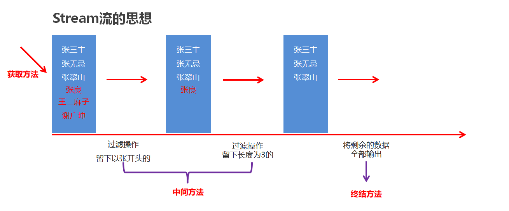

# 集合框架

## 1.Map集合

### 1.1Map集合概述和特点【理解】

- Map集合概述

  ```java
  interface Map<K,V>  K：键的类型；V：值的类型
  ```

- Map集合的特点

  - 双列集合,一个键对应一个值
  - 键不可以重复,值可以重复

- Map集合的基本使用

  ```java
  public class MapDemo01 {
      public static void main(String[] args) {
          //创建集合对象
          Map<String,String> map = new HashMap 是非线程安全的，[[12-多线程]] 中有 ConcurrentHashMap 作为线程安全替代。<String,String>();

          //V put(K key, V value) 将指定的值与该映射中的指定键相关联
          map.put("itheima001","林青霞");
          map.put("itheima002","张曼玉");
          map.put("itheima003","王祖贤");
          map.put("itheima003","柳岩");

          //输出集合对象
          System.out.println(map);
      }
  }
  ```

### 1.2Map集合的基本功能【应用】

- 方法介绍

  | 方法名                                 | 说明                 |
  | ----------------------------------- | ------------------ |
  | V   put(K key,V   value)            | 添加元素               |
  | V   remove(Object key)              | 根据键删除键值对元素         |
  | void   clear()                      | 移除所有的键值对元素         |
  | boolean containsKey(Object key)     | 判断集合是否包含指定的键       |
  | boolean containsValue(Object value) | 判断集合是否包含指定的值       |
  | boolean isEmpty()                   | 判断集合是否为空           |
  | int size()                          | 集合的长度，也就是集合中键值对的个数 |

- 示例代码

  ```java
  public class MapDemo02 {
      public static void main(String[] args) {
          //创建集合对象
          Map<String,String> map = new HashMap<String,String>();

          //V put(K key,V value)：添加元素
          map.put("张无忌","赵敏");
          map.put("郭靖","黄蓉");
          map.put("杨过","小龙女");

          //V remove(Object key)：根据键删除键值对元素
  //        System.out.println(map.remove("郭靖"));
  //        System.out.println(map.remove("郭襄"));

          //void clear()：移除所有的键值对元素
  //        map.clear();

          //boolean containsKey(Object key)：判断集合是否包含指定的键
  //        System.out.println(map.containsKey("郭靖"));
  //        System.out.println(map.containsKey("郭襄"));

          //boolean isEmpty()：判断集合是否为空
  //        System.out.println(map.isEmpty());

          //int size()：集合的长度，也就是集合中键值对的个数
          System.out.println(map.size());

          //输出集合对象
          System.out.println(map);
      }
  }
  ```

### 1.3Map集合的获取功能【应用】

- 方法介绍

  | 方法名                              | 说明           |
  | -------------------------------- | ------------ |
  | V   get(Object key)              | 根据键获取值       |
  | Set<K>   keySet()                | 获取所有键的集合     |
  | Collection<V>   values()         | 获取所有值的集合     |
  | Set<Map.Entry<K,V>>   entrySet() | 获取所有键值对对象的集合 |

- 示例代码

  ```java
  public class MapDemo03 {
      public static void main(String[] args) {
          //创建集合对象
          Map<String, String> map = new HashMap<String, String>();

          //添加元素
          map.put("张无忌", "赵敏");
          map.put("郭靖", "黄蓉");
          map.put("杨过", "小龙女");

          //V get(Object key):根据键获取值
  //        System.out.println(map.get("张无忌"));
  //        System.out.println(map.get("张三丰"));

          //Set<K> keySet():获取所有键的集合
  //        Set<String> keySet = map.keySet();
  //        for(String key : keySet) {
  //            System.out.println(key);
  //        }

          //Collection<V> values():获取所有值的集合
          Collection<String> values = map.values();
          for(String value : values) {
              System.out.println(value);
          }
      }
  }
  ```

### 1.4Map集合的遍历(方式1)【应用】

- 遍历思路

  - 我们刚才存储的元素都是成对出现的，所以我们把Map看成是一个夫妻对的集合
    - 把所有的丈夫给集中起来
    - 遍历丈夫的集合，获取到每一个丈夫
    - 根据丈夫去找对应的妻子

- 步骤分析

  - 获取所有键的集合。用keySet()方法实现
  - 遍历键的集合，获取到每一个键。用增强for实现  
  - 根据键去找值。用get(Object key)方法实现

- 代码实现

  ```java
  public class MapDemo01 {
      public static void main(String[] args) {
          //创建集合对象
          Map<String, String> map = new HashMap<String, String>();

          //添加元素
          map.put("张无忌", "赵敏");
          map.put("郭靖", "黄蓉");
          map.put("杨过", "小龙女");

          //获取所有键的集合。用keySet()方法实现
          Set<String> keySet = map.keySet();
          //遍历键的集合，获取到每一个键。用增强for实现
          for (String key : keySet) {
              //根据键去找值。用get(Object key)方法实现
              String value = map.get(key);
              System.out.println(key + "," + value);
          }
      }
  }
  ```

### 1.5Map集合的遍历(方式2)【应用】

- 遍历思路

  - 我们刚才存储的元素都是成对出现的，所以我们把Map看成是一个夫妻对的集合
    - 获取所有结婚证的集合
    - 遍历结婚证的集合，得到每一个结婚证
    - 根据结婚证获取丈夫和妻子

- 步骤分析

  - 获取所有键值对对象的集合
    - Set<Map.Entry<K,V>> entrySet()：获取所有键值对对象的集合
  - 遍历键值对对象的集合，得到每一个键值对对象
    - 用增强for实现，得到每一个Map.Entry
  - 根据键值对对象获取键和值
    - 用getKey()得到键
    - 用getValue()得到值

- 代码实现

  ```java
  public class MapDemo02 {
      public static void main(String[] args) {
          //创建集合对象
          Map<String, String> map = new HashMap<String, String>();

          //添加元素
          map.put("张无忌", "赵敏");
          map.put("郭靖", "黄蓉");
          map.put("杨过", "小龙女");

          //获取所有键值对对象的集合
          Set<Map.Entry<String, String>> entrySet = map.entrySet();
          //遍历键值对对象的集合，得到每一个键值对对象
          for (Map.Entry<String, String> me : entrySet) {
              //根据键值对对象获取键和值
              String key = me.getKey();
              String value = me.getValue();
              System.out.println(key + "," + value);
          }
      }
  }
  ```

## 2.HashMap集合

### 2.1HashMap集合概述和特点【理解】

+ HashMap底层是哈希表结构的
+ 依赖hashCode方法和equals方法保证键的唯一
+ 如果键要存储的是自定义对象，需要重写hashCode和equals方法

### 2.2HashMap集合应用案例【应用】

- 案例需求

  - 创建一个HashMap集合，键是学生对象(Student)，值是居住地 (String)。存储多个元素，并遍历。
  - 要求保证键的唯一性：如果学生对象的成员变量值相同，我们就认为是同一个对象

- 代码实现

  学生类

  ```java
  public class Student {
      private String name;
      private int age;

      public Student() {
      }

      public Student(String name, int age) {
          this.name = name;
          this.age = age;
      }

      public String getName() {
          return name;
      }

      public void setName(String name) {
          this.name = name;
      }

      public int getAge() {
          return age;
      }

      public void setAge(int age) {
          this.age = age;
      }

      @Override
      public boolean equals(Object o) {
          if (this == o) return true;
          if (o == null || getClass() != o.getClass()) return false;

          Student student = (Student) o;

          if (age != student.age) return false;
          return name != null ? name.equals(student.name) : student.name == null;
      }

      @Override
      public int hashCode() {
          int result = name != null ? name.hashCode() : 0;
          result = 31 * result + age;
          return result;
      }
  }
  ```

  测试类

  ```java
  public class HashMapDemo {
      public static void main(String[] args) {
          //创建HashMap集合对象
          HashMap<Student, String> hm = new HashMap<Student, String>();

          //创建学生对象
          Student s1 = new Student("林青霞", 30);
          Student s2 = new Student("张曼玉", 35);
          Student s3 = new Student("王祖贤", 33);
          Student s4 = new Student("王祖贤", 33);

          //把学生添加到集合
          hm.put(s1, "西安");
          hm.put(s2, "武汉");
          hm.put(s3, "郑州");
          hm.put(s4, "北京");

          //遍历集合
          Set<Student> keySet = hm.keySet();
          for (Student key : keySet) {
              String value = hm.get(key);
              System.out.println(key.getName() + "," + key.getAge() + "," + value);
          }
      }
  }
  ```

## 3.TreeMap 底层是红黑树，其排序依赖 [[05-面向对象编程]] 中的 Comparable/Comparator 接口。集合

### 3.1TreeMap集合概述和特点【理解】

+ TreeMap底层是红黑树结构
+ 依赖自然排序或者比较器排序,对键进行排序
+ 如果键存储的是自定义对象,需要实现Comparable接口或者在创建TreeMap对象时候给出比较器排序规则

### 3.2TreeMap集合应用案例【应用】

+ 案例需求

  + 创建一个TreeMap集合,键是学生对象(Student),值是籍贯(String),学生属性姓名和年龄,按照年龄进行排序并遍历
  + 要求按照学生的年龄进行排序,如果年龄相同则按照姓名进行排序

+ 代码实现

  学生类

  ```java
  public class Student implements Comparable<Student>{
      private String name;
      private int age;

      public Student() {
      }

      public Student(String name, int age) {
          this.name = name;
          this.age = age;
      }

      public String getName() {
          return name;
      }

      public void setName(String name) {
          this.name = name;
      }

      public int getAge() {
          return age;
      }

      public void setAge(int age) {
          this.age = age;
      }

      @Override
      public String toString() {
          return "Student{" +
                  "name='" + name + '\'' +
                  ", age=" + age +
                  '}';
      }

      @Override
      public int compareTo(Student o) {
          //按照年龄进行排序
          int result = o.getAge() - this.getAge();
          //次要条件，按照姓名排序。
          result = result == 0 ? o.getName().compareTo(this.getName()) : result;
          return result;
      }
  }
  ```

  测试类

  ```java
  public class Test1 {
      public static void main(String[] args) {
        	// 创建TreeMap集合对象
          TreeMap<Student,String> tm = new TreeMap<>();
        
  		// 创建学生对象
          Student s1 = new Student("xiaohei",23);
          Student s2 = new Student("dapang",22);
          Student s3 = new Student("xiaomei",22);
        
  		// 将学生对象添加到TreeMap集合中
          tm.put(s1,"江苏");
          tm.put(s2,"北京");
          tm.put(s3,"天津");
        
  		// 遍历TreeMap集合,打印每个学生的信息
          tm.forEach(
                  (Student key, String value)->{
                      System.out.println(key + "---" + value);
                  }
          );
      }
  }
  ```


---


# 1. 可变参数

在**JDK1.5**之后，如果我们定义一个方法需要接受多个参数，并且多个参数类型一致，我们可以对其简化.

**格式：**

```
修饰符 返回值类型 方法名(参数类型... 形参名){  }
```

**底层：**

​	其实就是一个数组

**好处：**

​	在传递数据的时候，省的我们自己创建数组并添加元素了，JDK底层帮我们自动创建数组并添加元素了

**代码演示:**

```java
  public class ChangeArgs {
    public static void main(String[] args) {
        int sum = getSum(6, 7, 2, 12, 2121);
        System.out.println(sum);
    }
    
    public static int getSum(int... arr) {
   		int sum = 0;
   	     for (int a : arr) {
         sum += a;
        }
   		 return sum;
    }
}
```

**注意：**

​	1.一个方法只能有一个可变参数

​	2.如果方法中有多个参数，可变参数要放到最后。

**应用场景: Collections**

​	在Collections中也提供了添加一些元素方法：

​	`public static <T> boolean addAll(Collection<T> c, T... elements)  `:往集合中添加一些元素。

**代码演示:**

```java
public class CollectionsDemo {
	public static void main(String[] args) {
      ArrayList<Integer> list = new ArrayList<Integer>();
      //原来写法
      //list.add(12);
      //list.add(14);
      //list.add(15);
      //list.add(1000);
      //采用工具类 完成 往集合中添加元素  
      Collections.addAll(list, 5, 222, 1，2);
      System.out.println(list);
}
```

# 2. Collections类

## 2.1 Collections常用功能

- `java.utils.Collections`是集合工具类，用来对集合进行操作。

  常用方法如下：

- `public static void shuffle(List<?> list) `:打乱集合顺序。
- `public static <T> void sort(List<T> list)`:将集合中元素按照默认规则排序。
- `public static <T> void sort(List<T> list，Comparator<? super T> )`:将集合中元素按照指定规则排序。

代码演示：

```java
public class CollectionsDemo {
    public static void main(String[] args) {
        ArrayList<Integer> list = new ArrayList<Integer>();
   
        list.add(100);
        list.add(300);
        list.add(200);
        list.add(50);
        //排序方法 
        Collections.sort(list);
        System.out.println(list);
    }
}
结果：
[50,100, 200, 300]
```

我们的集合按照默认的自然顺序进行了排列，如果想要指定顺序那该怎么办呢？

## 2.2 Comparator比较器

创建一个学生类，存储到ArrayList集合中完成指定排序操作。

Student 类

```java
public class Student{
    private String name;
    private int age;
	//构造方法
    //get/set
 	//toString
}
```

测试类：

```java
public class Demo {
    public static void main(String[] args) {
        // 创建四个学生对象 存储到集合中
        ArrayList<Student> list = new ArrayList<Student>();

        list.add(new Student("rose",18));
        list.add(new Student("jack",16));
        list.add(new Student("abc",20));
		Collections.sort(list, new Comparator<Student>() {
  		  @Override
    		public int compare(Student o1, Student o2) {
        	return o1.getAge()-o2.getAge();//以学生的年龄升序
   		 }
		});


        for (Student student : list) {
            System.out.println(student);
        }
    }
}
Student{name='jack', age=16}
Student{name='rose', age=18}
Student{name='abc', age=20}
```

# 3. 综合练习

### 练习1：随机点名器

需求：班级里有N个学生，实现随机点名器

代码实现：

```java
public class Test1 {
    public static void main(String[] args) {
        /* 班级里有N个学生，学生属性:姓名，年龄，性别。
        实现随机点名器。*/


        //1.定义集合
        ArrayList<String> list = new ArrayList<>();
        //2.添加数据
        Collections.addAll(list,"范闲","范建","范统","杜子腾","杜琦燕","宋合泛","侯笼藤","朱益群","朱穆朗玛峰","袁明媛");
        //3.随机点名
        /* Random r = new Random();
        int index = r.nextInt(list.size());
        String name = list.get(index);
        System.out.println(name);*/

        //打乱
        Collections.shuffle(list);

        String name = list.get(0);
        System.out.println(name);


    }
}
```

### 练习2：带概率的随机

需求：

​	班级里有N个学生

​	要求在随机的时候，70%的概率随机到男生，30%的概率随机到女生

代码实现：

```java
public class Test2 {
    public static void main(String[] args) {
        /* 班级里有N个学生
        要求：
        70%的概率随机到男生
        30%的概率随机到女生

        "范闲","范建","范统","杜子腾","宋合泛","侯笼藤","朱益群","朱穆朗玛峰",
        "杜琦燕","袁明媛","李猜","田蜜蜜",
        */
        //1.创建集合
        ArrayList<Integer> list = new ArrayList<>();
        //2.添加数据
        Collections.addAll(list,1,1,1,1,1,1,1);
        Collections.addAll(list,0,0,0);
        //3.打乱集合中的数据
        Collections.shuffle(list);
        //4.从list集合中随机抽取0或者1
        Random r = new Random();
        int index = r.nextInt(list.size());
        int number = list.get(index);
        System.out.println(number);
        //5.创建两个集合分别存储男生和女生的名字
        ArrayList<String> boyList = new ArrayList<>();
        ArrayList<String> girlList = new ArrayList<>();

        Collections.addAll(boyList,"范闲","范建","范统","杜子腾","宋合泛","侯笼藤","朱益群","朱穆朗玛峰");
        Collections.addAll(girlList,"杜琦燕","袁明媛","李猜","田蜜蜜");

        //6.判断此时是从boyList里面抽取还是从girlList里面抽取
        if(number == 1){
            //boyList
            int boyIndex = r.nextInt(boyList.size());
            String name = boyList.get(boyIndex);
            System.out.println(name);
        }else{
            //girlList
            int girlIndex = r.nextInt(girlList.size());
            String name = girlList.get(girlIndex);
            System.out.println(name);
        }


    }
}
```

### 练习3：随机不重复

需求：

​	班级里有N个学生，被点到的学生不会再被点到。但是如果班级中所有的学生都点完了， 需要重新开启第二轮点名。

代码实现：

```java
public class Test3 {
    public static void main(String[] args) {
       /* 班级里有5个学生
        要求：
        被点到的学生不会再被点到。
        但是如果班级中所有的学生都点完了，需要重新开启第二轮点名。*/


        //1.定义集合
        ArrayList<String> list1 = new ArrayList<>();
        //2.添加数据
        Collections.addAll(list1, "范闲", "范建", "范统", "杜子腾", "杜琦燕", "宋合泛", "侯笼藤", "朱益群", "朱穆朗玛峰", "袁明媛");
        //创建一个临时的集合，用来存已经被点到学生的名字
        ArrayList<String> list2 = new ArrayList<>();
        //外循环：表示轮数
        for (int i = 1; i <= 10; i++) {
            System.out.println("=========第" + i + "轮点名开始了======================");
            //3.获取集合的长度
            int count = list1.size();
            //4.随机点名
            Random r = new Random();
            //内循环：每一轮中随机循环抽取的过程
            for (int j = 0; j < count; j++) {
                int index = r.nextInt(list1.size());
                String name = list1.remove(index);
                list2.add(name);
                System.out.println(name);
            }
            //此时表示一轮点名结束
            //list1 空了 list2 10个学生的名字
            list1.addAll(list2);
            list2.clear();

        }
    }
}
```

## 练习4：集合的嵌套

需求：

​	定义一个Map集合，键用表示省份名称province，值表示市city，但是市会有多个。

添加完毕后，遍历结果格式如下：

​	江苏省 = 南京市，扬州市，苏州市，无锡市，常州市

  	湖北省 = 武汉市，孝感市，十堰市，宜昌市，鄂州市

  	河北省 = 石家庄市，唐山市，邢台市，保定市，张家口市

代码实现：

```java
public class Test4 {
    public static void main(String[] args) {
        /* 需求
        定义一个Map集合，键用表示省份名称province，值表示市city，但是市会有多个。
        添加完毕后，遍历结果格式如下：
                江苏省 = 南京市，扬州市，苏州市，无锡市，常州市
                湖北省 = 武汉市，孝感市，十堰市，宜昌市，鄂州市
                河北省 = 石家庄市，唐山市，邢台市，保定市，张家口市*/


        //1.创建Map集合
        HashMap<String, ArrayList<String>> hm = new HashMap<>();

        //2.创建单列集合存储市
        ArrayList<String> city1 = new ArrayList<>();
        city1.add("南京市");
        city1.add("扬州市");
        city1.add("苏州市");
        city1.add("无锡市");
        city1.add("常州市");

        ArrayList<String> city2 = new ArrayList<>();
        city2.add("武汉市");
        city2.add("孝感市");
        city2.add("十堰市");
        city2.add("宜昌市");
        city2.add("鄂州市");

        ArrayList<String> city3 = new ArrayList<>();
        city3.add("石家庄市");
        city3.add("唐山市");
        city3.add("邢台市");
        city3.add("保定市");
        city3.add("张家口市");

        //3.把省份和多个市添加到map集合
        hm.put("江苏省",city1);
        hm.put("湖北省",city2);
        hm.put("河北省",city3);

        Set<Map.Entry<String, ArrayList<String>>> entries = hm.entrySet();
        for (Map.Entry<String, ArrayList<String>> entry : entries) {
            //entry依次表示每一个键值对对象
            String key = entry.getKey();
            ArrayList<String> value = entry.getValue();
            StringJoiner sj = new StringJoiner(", ","","");
            for (String city : value) {
                sj.add(city);
            }
            System.out.println(key + " = " + sj);

        }
    }
}
```

# 4. 斗地主游戏是集合框架的综合应用，排序逻辑同样适用于 [[06-面向对象综合练习]] 中的拼图游戏排序。发牌

## 4.1 案例介绍

按照斗地主的规则，完成洗牌发牌的动作。
具体规则：

使用54张牌打乱顺序,三个玩家参与游戏，三人交替摸牌，每人17张牌，最后三张留作底牌。

## 4.2 案例分析

- 准备牌：

  牌可以设计为一个ArrayList<String>,每个字符串为一张牌。
  每张牌由花色数字两部分组成，我们可以使用花色集合与数字集合嵌套迭代完成每张牌的组装。
  牌由Collections类的shuffle方法进行随机排序。

- 发牌

  将每个人以及底牌设计为ArrayList<String>,将最后3张牌直接存放于底牌，剩余牌通过对3取模依次发牌。

- 看牌

  直接打印每个集合。

## 4.3 代码实现

```java
public class App {
    public static void main(String[] args) {
      /*
        完成控制台版的三步：
          准备牌
          洗牌
          发牌
       */
        //从程序的主入口开启斗地主游戏
        new PokerGame();
    }
}

public class PokerGame {
    //牌盒
    //♥3 ♣3
    static ArrayList<String> list = new ArrayList<>();

    //静态代码块
    //特点：随着类的加载而在加载的，而且只执行一次。
    static {
        //准备牌
        // "♦", "♣", "♥", "♠"
        // "3", "4", "5", "6", "7", "8", "9", "10", "J", "Q", "K", "A", "2"
        String[] color = {"♦", "♣", "♥", "♠" };
        String[] number = {"3", "4", "5", "6", "7", "8", "9", "10", "J", "Q", "K", "A", "2"};

        for (String c : color) {
            //c依次表示每一种花色
            for (String n : number) {
                //n 依次表示每一个数字
                list.add(c + n);
            }
        }
        list.add("小王");
        list.add("大王");
    }

    public PokerGame(){
        //洗牌
        Collections.shuffle(list);

        //发牌
        ArrayList<String> lord = new ArrayList<>();
        ArrayList<String> player1 = new ArrayList<>();
        ArrayList<String> player2 = new ArrayList<>();
        ArrayList<String> player3 = new ArrayList<>();

        //遍历牌盒得到每一张牌
        for (int i = 0; i < list.size(); i++) {
            //i：索引
            String poker = list.get(i);
            if(i <= 2){
                lord.add(poker);
                continue;
            }

            //给三个玩家轮流发牌
            if(i % 3 == 0){
                player1.add(poker);
            }else if(i % 3 == 1){
                player2.add(poker);
            }else{
                player3.add(poker);
            }
        }
        //看牌
        lookPoker("底牌",lord);
        lookPoker("钢脑壳",player1);
        lookPoker("大帅比",player2);
        lookPoker("蛋筒",player3);

    }

    /*
    * 参数一：玩家的名字
    * 参数二：每位玩家的牌
    * */
    public void lookPoker(String name, ArrayList<String> list){
        System.out.print(name + ": ");
        for (String poker : list) {
            System.out.print(poker + " ");
        }
        System.out.println();
    }
}
```

## 4.4 排序（第一种排序方式）

```java
public class App {
    public static void main(String[] args) {
      /*
        完成控制台版的四步：
          准备牌
          洗牌
          发牌
          排序

       */

		//从程序的主入口开启斗地主游戏
        new PokerGame();
    }
}


public class PokerGame {
    //牌盒 Map
    //此时我们只要把牌跟序号产生对应关系就可以了，不需要按照序号进行排序，所以只要HashMap就可以了
    static HashMap<Integer, String> hm = new HashMap<>();
    static ArrayList<Integer> list = new ArrayList<>();

    static {
        String[] color = {"♦", "♣", "♥", "♠"};
        String[] number = {"3", "4", "5", "6", "7", "8", "9", "10", "J", "Q", "K", "A", "2"};

        //序号
        int serialNumber = 1;
        //细节
        for (String n : number) {
            //依次表示每一个数字
            for (String c : color) {
                //依次表示每一个花色
                hm.put(serialNumber, c + n);
                list.add(serialNumber);
                serialNumber++;
            }
        }

        hm.put(serialNumber, "小王");
        list.add(serialNumber);
        serialNumber++;
        hm.put(serialNumber, "大王");
        list.add(serialNumber);

    }

    public PokerGame() {
        //洗牌
        Collections.shuffle(list);

        //发牌
        TreeSet<Integer> lord = new TreeSet<>();
        TreeSet<Integer> player1 = new TreeSet<>();
        TreeSet<Integer> player2 = new TreeSet<>();
        TreeSet<Integer> player3 = new TreeSet<>();

        for (int i = 0; i < list.size(); i++) {
            //i :依次表示集合中的每一个索引
            //list.get(i)元素：牌的序号
            int serialNumber = list.get(i);

            if(i <= 2){
                lord.add(serialNumber);
                continue;
            }

            if(i % 3 == 0){
                player1.add(serialNumber);
            }else if(i % 3 == 1){
                player2.add(serialNumber);
            }else{
                player3.add(serialNumber);
            }
        }


        //看牌
        lookPoker("底牌",lord);
        lookPoker("钢脑壳",player1);
        lookPoker("大帅比",player2);
        lookPoker("蛋筒",player3);

    }

    /*
    * 参数一：玩家的名字
    * 参数二：牌的序号
    * */
    public void lookPoker(String name, TreeSet<Integer> ts){
        System.out.print(name + ": ");
        //遍历TreeSet集合得到每一个序号，再拿着序号到Map集合中去找真正的牌
        for (int serialNumber : ts) {
            String poker = hm.get(serialNumber);
            System.out.print(poker + " ");
        }
        System.out.println();
    }
}
```

## 4.5 排序（第二种排序方式）

```java
public class App {
    public static void main(String[] args) {
        new PokerGame();
    }
}


public class PokerGame {
    //牌盒
    static ArrayList<String> list = new ArrayList<>();

    //创建一个集合，用来添加牌的价值
    static HashMap<String, Integer> hm = new HashMap<>();

    static {
        //准备牌
        String[] color = {"♦", "♣", "♥", "♠"};
        String[] number = {"3", "4", "5", "6", "7", "8", "9", "10", "J", "Q", "K", "A", "2"};

        for (String c : color) {
            for (String n : number) {
                list.add(c + n);
            }
        }
        list.add(" 小王");
        list.add(" 大王");


        //指定牌的价值
        //牌上的数字到Map集合中判断是否存在
        //存在，获取价值
        //不存在，本身的数字就是价值
        hm.put("J", 11);
        hm.put("Q", 12);
        hm.put("K", 13);
        hm.put("A", 14);
        hm.put("2", 15);
        hm.put("小王", 50);
        hm.put("大王", 100);


    }

    public PokerGame() {
        //洗牌
        Collections.shuffle(list);

        //发牌
        ArrayList<String> lord = new ArrayList<>();
        ArrayList<String> player1 = new ArrayList<>();
        ArrayList<String> player2 = new ArrayList<>();
        ArrayList<String> player3 = new ArrayList<>();

        for (int i = 0; i < list.size(); i++) {
            String poker = list.get(i);
            //发底牌
            if (i <= 2) {
                lord.add(poker);
                continue;
            }

            //给三个玩家轮流发牌
            if (i % 3 == 0) {
                player1.add(poker);
            } else if (i % 3 == 1) {
                player2.add(poker);
            } else {
                player3.add(poker);
            }
        }


        //排序
        order(lord);
        order(player1);
        order(player2);
        order(player3);


        //看牌
        lookPoker("底牌",lord);
        lookPoker("钢脑壳",player1);
        lookPoker("大帅比",player2);
        lookPoker("蛋筒",player3);
    }


    /*
     * 参数一：玩家的名字
     * 参数二：每位玩家的牌
     * */
    public void lookPoker(String name, ArrayList<String> list){
        System.out.print(name + ": ");
        for (String poker : list) {
            System.out.print(poker + " ");
        }
        System.out.println();

    }


    //利用牌的价值进行排序
    //参数：集合
    //♥5 ♥3 ♥6 ♥7 ♥9
    public void order(ArrayList<String> list){
        Collections.sort(list, new Comparator<String>() {
            //Array.sort （插入排序 + 二分查找）
            @Override
            public int compare(String o1, String o2) {
                //o1：表示当前要插入到有序序列中的牌
                //o2：表示已经在有序序列中存在的牌

                //负数：o1小 插入到前面
                //正数：o1大 插入到后面
                //0：o1的数字跟o2的数字是一样的，需要按照花色再次排序

                //1.计算o1的花色和价值   大王
                String color1 = o1.substring(0, 1);
                int value1 = getValue(o1);

                //2.计算o2的花色和价值
                String color2 = o2.substring(0, 1);
                int value2 = getValue(o2);

                //3.比较o1和o2的价值    ♥3  ♠3
                int i = value1 - value2;
                return i == 0 ? color1.compareTo(color2) : i;

            }
        });
    }

    //计算牌的价值
    //参数：牌
    //返回值：价值
    public int getValue(String poker){//♥3
        //获取牌上的数字
        String number = poker.substring(1);//把这里截取出来的结果，让这个结果再Map集合中存在 “ 大王”
        //拿着数字到map集合中判断是否存在
        if(hm.containsKey(number)){
            //存在，获取价值
            return hm.get(number);
        }else{
            //不存在，类型转换
            return Integer.parseInt(number);
        }
    }
}
```


---


## 1.不可变集合

### 1.1 什么是不可变集合

​	是一个长度不可变，内容也无法修改的集合

### 1.2 使用场景

​	如果某个数据不能被修改，把它防御性地拷贝到不可变集合中是个很好的实践。

​	当集合对象被不可信的库调用时，不可变形式是安全的。

简单理解：

​	不想让别人修改集合中的内容

比如说：

1，斗地主的54张牌，是不能添加，不能删除，不能修改的

2，斗地主的打牌规则：单张，对子，三张，顺子等，也是不能修改的

3，用代码获取的操作系统硬件信息，也是不能被修改的

### 1.3 不可变集合分类

* 不可变的list集合
* 不可变的set集合
* 不可变的map集合

### 1.4 不可变的list集合

```java
public class ImmutableDemo1 {
    public static void main(String[] args) {
        /*
            创建不可变的List集合
            "张三", "李四", "王五", "赵六"
        */

        //一旦创建完毕之后，是无法进行修改的，在下面的代码中，只能进行查询操作
        List<String> list = List.of("张三", "李四", "王五", "赵六");

        System.out.println(list.get(0));
        System.out.println(list.get(1));
        System.out.println(list.get(2));
        System.out.println(list.get(3));

        System.out.println("---------------------------");

        for (String s : list) {
            System.out.println(s);
        }

        System.out.println("---------------------------");


        Iterator<String> it = list.iterator();
        while(it.hasNext()){
            String s = it.next();
            System.out.println(s);
        }
        System.out.println("---------------------------");

        for (int i = 0; i < list.size(); i++) {
            String s = list.get(i);
            System.out.println(s);
        }
        System.out.println("---------------------------");

        //list.remove("李四");
        //list.add("aaa");
        list.set(0,"aaa");
    }
}
```

### 1.5 不可变的Set集合

```java
public class ImmutableDemo2 {
    public static void main(String[] args) {
        /*
           创建不可变的Set集合
           "张三", "李四", "王五", "赵六"


           细节：
                当我们要获取一个不可变的Set集合时，里面的参数一定要保证唯一性
        */

        //一旦创建完毕之后，是无法进行修改的，在下面的代码中，只能进行查询操作
        Set<String> set = Set.of("张三", "张三", "李四", "王五", "赵六");

        for (String s : set) {
            System.out.println(s);
        }

        System.out.println("-----------------------");

        Iterator<String> it = set.iterator();
        while(it.hasNext()){
            String s = it.next();
            System.out.println(s);
        }

        System.out.println("-----------------------");
        //set.remove("王五");
    }
}
```

### 1.6 不可变的Map集合

#### 1.6.1：键值对个数小于等于10

```java
public class ImmutableDemo3 {
    public static void main(String[] args) {
       /*
        创建Map的不可变集合
            细节1：
                键是不能重复的
            细节2：
                Map里面的of方法，参数是有上限的，最多只能传递20个参数，10个键值对
            细节3：
                如果我们要传递多个键值对对象，数量大于10个，在Map接口中还有一个方法
        */

        //一旦创建完毕之后，是无法进行修改的，在下面的代码中，只能进行查询操作
        Map<String, String> map = Map.of("张三", "南京", "张三", "北京", "王五", "上海",
                "赵六", "广州", "孙七", "深圳", "周八", "杭州",
                "吴九", "宁波", "郑十", "苏州", "刘一", "无锡",
                "陈二", "嘉兴");

        Set<String> keys = map.keySet();
        for (String key : keys) {
            String value = map.get(key);
            System.out.println(key + "=" + value);
        }

        System.out.println("--------------------------");

        Set<Map.Entry<String, String>> entries = map.entrySet();
        for (Map.Entry<String, String> entry : entries) {
            String key = entry.getKey();
            String value = entry.getValue();
            System.out.println(key + "=" + value);
        }
        System.out.println("--------------------------");
    }
}
```

#### 1.6.2：键值对个数大于10

```java
public class ImmutableDemo4 {
    public static void main(String[] args) {

        /*
            创建Map的不可变集合,键值对的数量超过10个
        */

        //1.创建一个普通的Map集合
        HashMap<String, String> hm = new HashMap<>();
        hm.put("张三", "南京");
        hm.put("李四", "北京");
        hm.put("王五", "上海");
        hm.put("赵六", "北京");
        hm.put("孙七", "深圳");
        hm.put("周八", "杭州");
        hm.put("吴九", "宁波");
        hm.put("郑十", "苏州");
        hm.put("刘一", "无锡");
        hm.put("陈二", "嘉兴");
        hm.put("aaa", "111");

        //2.利用上面的数据来获取一个不可变的集合
/*
        //获取到所有的键值对对象（Entry对象）
        Set<Map.Entry<String, String>> entries = hm.entrySet();
        //把entries变成一个数组
        Map.Entry[] arr1 = new Map.Entry[0];
        //toArray方法在底层会比较集合的长度跟数组的长度两者的大小
        //如果集合的长度 > 数组的长度 ：数据在数组中放不下，此时会根据实际数据的个数，重新创建数组
        //如果集合的长度 <= 数组的长度：数据在数组中放的下，此时不会创建新的数组，而是直接用
        Map.Entry[] arr2 = entries.toArray(arr1);
        //不可变的map集合
        Map map = Map.ofEntries(arr2);
        map.put("bbb","222");*/


        //Map<Object, Object> map = Map.ofEntries(hm.entrySet().toArray(new Map.Entry[0]));

        Map<String, String> map = Map.copyOf(hm);
        map.put("bbb","222");
    }
}
```

## 2.Stream 的 filter/map/reduce 操作配合 [[09-常用API]] 中的 Lambda 表达式使用。

### 2.1体验Stream流【理解】

- 案例需求

  按照下面的要求完成集合的创建和遍历

  - 创建一个集合，存储多个字符串元素
  - 把集合中所有以"张"开头的元素存储到一个新的集合
  - 把"张"开头的集合中的长度为3的元素存储到一个新的集合
  - 遍历上一步得到的集合

- 原始方式示例代码

  ```java
  public class MyStream1 {
      public static void main(String[] args) {
          //集合的批量添加
          ArrayList<String> list1 = new ArrayList<>(List.of("张三丰","张无忌","张翠山","王二麻子","张良","谢广坤"));
          //list.add()

          //遍历list1把以张开头的元素添加到list2中。
          ArrayList<String> list2 = new ArrayList<>();
          for (String s : list1) {
              if(s.startsWith("张")){
                  list2.add(s);
              }
          }
          //遍历list2集合，把其中长度为3的元素，再添加到list3中。
          ArrayList<String> list3 = new ArrayList<>();
          for (String s : list2) {
              if(s.length() == 3){
                  list3.add(s);
              }
          }
          for (String s : list3) {
              System.out.println(s);
          }      
      }
  }
  ```

- 使用Stream流示例代码

  ```java
  public class StreamDemo {
      public static void main(String[] args) {
          //集合的批量添加
          ArrayList<String> list1 = new ArrayList<>(List.of("张三丰","张无忌","张翠山","王二麻子","张良","谢广坤"));

          //Stream流
          list1.stream().filter(s->s.startsWith("张"))
                  .filter(s->s.length() == 3)
                  .forEach(s-> System.out.println(s));
      }
  }
  ```

- Stream流的好处

  - 直接阅读代码的字面意思即可完美展示无关逻辑方式的语义：获取流、过滤姓张、过滤长度为3、逐一打印
  - Stream流把真正的函数式编程风格引入到Java中
  - 代码简洁

### 2.2Stream流的常见生成方式【应用】

- Stream流的思想

  )

- Stream流的三类方法

  - 获取Stream流
    - 创建一条流水线,并把数据放到流水线上准备进行操作
  - 中间方法
    - 流水线上的操作
    - 一次操作完毕之后,还可以继续进行其他操作
  - 终结方法
    - 一个Stream流只能有一个终结方法
    - 是流水线上的最后一个操作

- 生成Stream流的方式

  - Collection体系集合

    使用默认方法stream()生成流， default Stream<E> stream()

  - Map体系集合

    把Map转成Set集合，间接的生成流

  - 数组

    通过Arrays中的静态方法stream生成流

  - 同种数据类型的多个数据

    通过Stream接口的静态方法of(T... values)生成流

- 代码演示

  ```java
  public class StreamDemo {
      public static void main(String[] args) {
          //Collection体系的集合可以使用默认方法stream()生成流
          List<String> list = new ArrayList<String>();
          Stream<String> listStream = list.stream();
  
          Set<String> set = new HashSet<String>();
          Stream<String> setStream = set.stream();
  
          //Map体系的集合间接的生成流
          Map<String,Integer> map = new HashMap<String, Integer>();
          Stream<String> keyStream = map.keySet().stream();
          Stream<Integer> valueStream = map.values().stream();
          Stream<Map.Entry<String, Integer>> entryStream = map.entrySet().stream();
  
          //数组可以通过Arrays中的静态方法stream生成流
          String[] strArray = {"hello","world","java"};
          Stream<String> strArrayStream = Arrays.stream(strArray);
        
        	//同种数据类型的多个数据可以通过Stream接口的静态方法of(T... values)生成流
          Stream<String> strArrayStream2 = Stream.of("hello", "world", "java");
          Stream<Integer> intStream = Stream.of(10, 20, 30);
      }
  }
  ```

### 2.3Stream流中间操作方法【应用】

- 概念

  中间操作的意思是,执行完此方法之后,Stream流依然可以继续执行其他操作

- 常见方法

  | 方法名                                      | 说明                                       |
  | ---------------------------------------- | ---------------------------------------- |
  | Stream<T> filter(Predicate predicate)    | 用于对流中的数据进行过滤                             |
  | Stream<T> limit(long maxSize)            | 返回此流中的元素组成的流，截取前指定参数个数的数据                |
  | Stream<T> skip(long n)                   | 跳过指定参数个数的数据，返回由该流的剩余元素组成的流               |
  | static <T> Stream<T> concat(Stream a, Stream b) | 合并a和b两个流为一个流                             |
  | Stream<T> distinct()                     | 返回由该流的不同元素（根据Object.equals(Object) ）组成的流 |

- filter代码演示

  ```java
  public class MyStream3 {
      public static void main(String[] args) {
  //        Stream<T> filter(Predicate predicate)：过滤
  //        Predicate接口中的方法	boolean test(T t)：对给定的参数进行判断，返回一个布尔值

          ArrayList<String> list = new ArrayList<>();
          list.add("张三丰");
          list.add("张无忌");
          list.add("张翠山");
          list.add("王二麻子");
          list.add("张良");
          list.add("谢广坤");

          //filter方法获取流中的 每一个数据.
          //而test方法中的s,就依次表示流中的每一个数据.
          //我们只要在test方法中对s进行判断就可以了.
          //如果判断的结果为true,则当前的数据留下
          //如果判断的结果为false,则当前数据就不要.
  //        list.stream().filter(
  //                new Predicate<String>() {
  //                    @Override
  //                    public boolean test(String s) {
  //                        boolean result = s.startsWith("张");
  //                        return result;
  //                    }
  //                }
  //        ).forEach(s-> System.out.println(s));

          //因为Predicate接口中只有一个抽象方法test
          //所以我们可以使用lambda表达式来简化
  //        list.stream().filter(
  //                (String s)->{
  //                    boolean result = s.startsWith("张");
  //                        return result;
  //                }
  //        ).forEach(s-> System.out.println(s));

          list.stream().filter(s ->s.startsWith("张")).forEach(s-> System.out.println(s));

      }
  }
  ```

- limit&skip代码演示

  ```java
  public class StreamDemo02 {
      public static void main(String[] args) {
          //创建一个集合，存储多个字符串元素
          ArrayList<String> list = new ArrayList<String>();

          list.add("林青霞");
          list.add("张曼玉");
          list.add("王祖贤");
          list.add("柳岩");
          list.add("张敏");
          list.add("张无忌");

          //需求1：取前3个数据在控制台输出
          list.stream().limit(3).forEach(s-> System.out.println(s));
          System.out.println("--------");

          //需求2：跳过3个元素，把剩下的元素在控制台输出
          list.stream().skip(3).forEach(s-> System.out.println(s));
          System.out.println("--------");

          //需求3：跳过2个元素，把剩下的元素中前2个在控制台输出
          list.stream().skip(2).limit(2).forEach(s-> System.out.println(s));
      }
  }
  ```

- concat&distinct代码演示

  ```java
  public class StreamDemo03 {
      public static void main(String[] args) {
          //创建一个集合，存储多个字符串元素
          ArrayList<String> list = new ArrayList<String>();
  
          list.add("林青霞");
          list.add("张曼玉");
          list.add("王祖贤");
          list.add("柳岩");
          list.add("张敏");
          list.add("张无忌");
  
          //需求1：取前4个数据组成一个流
          Stream<String> s1 = list.stream().limit(4);
  
          //需求2：跳过2个数据组成一个流
          Stream<String> s2 = list.stream().skip(2);
  
          //需求3：合并需求1和需求2得到的流，并把结果在控制台输出
  //        Stream.concat(s1,s2).forEach(s-> System.out.println(s));
  
          //需求4：合并需求1和需求2得到的流，并把结果在控制台输出，要求字符串元素不能重复
          Stream.concat(s1,s2).distinct().forEach(s-> System.out.println(s));
      }
  }
  ```

### 2.4Stream流终结操作方法【应用】

- 概念

  终结操作的意思是,执行完此方法之后,Stream流将不能再执行其他操作

- 常见方法

  | 方法名                           | 说明           |
  | ----------------------------- | ------------ |
  | void forEach(Consumer action) | 对此流的每个元素执行操作 |
  | long count()                  | 返回此流中的元素数    |

- 代码演示

  ```java
  public class MyStream5 {
      public static void main(String[] args) {
          ArrayList<String> list = new ArrayList<>();
          list.add("张三丰");
          list.add("张无忌");
          list.add("张翠山");
          list.add("王二麻子");
          list.add("张良");
          list.add("谢广坤");
  
          //method1(list);
          
  //        long count()：返回此流中的元素数
          long count = list.stream().count();
          System.out.println(count);
      }
  
      private static void method1(ArrayList<String> list) {
          //  void forEach(Consumer action)：对此流的每个元素执行操作
          //  Consumer接口中的方法void accept(T t)：对给定的参数执行此操作
          //在forEach方法的底层,会循环获取到流中的每一个数据.
          //并循环调用accept方法,并把每一个数据传递给accept方法
          //s就依次表示了流中的每一个数据.
          //所以,我们只要在accept方法中,写上处理的业务逻辑就可以了.
          list.stream().forEach(
                  new Consumer<String>() {
                      @Override
                      public void accept(String s) {
                          System.out.println(s);
                      }
                  }
          );
        
          System.out.println("====================");
          //lambda表达式的简化格式
          //是因为Consumer接口中,只有一个accept方法
          list.stream().forEach(
                  (String s)->{
                      System.out.println(s);
                  }
          );
          System.out.println("====================");
          //lambda表达式还是可以进一步简化的.
          list.stream().forEach(s->System.out.println(s));
      }
  }
  ```

### 2.5Stream流的收集操作【应用】

- 概念

  对数据使用Stream流的方式操作完毕后,可以把流中的数据收集到集合中

- 常用方法

  | 方法名                            | 说明        |
  | ------------------------------ | --------- |
  | R collect(Collector collector) | 把结果收集到集合中 |

- 工具类Collectors提供了具体的收集方式

  | 方法名                                                       | 说明                   |
  | ------------------------------------------------------------ | ---------------------- |
  | public static <T> Collector toList()                         | 把元素收集到List集合中 |
  | public static <T> Collector toSet()                          | 把元素收集到Set集合中  |
  | public static  Collector toMap(Function keyMapper,Function valueMapper) | 把元素收集到Map集合中  |

- 代码演示

  ```java
  // toList和toSet方法演示 
  public class MyStream7 {
      public static void main(String[] args) {
          ArrayList<Integer> list1 = new ArrayList<>();
          for (int i = 1; i <= 10; i++) {
              list1.add(i);
          }
  
          list1.add(10);
          list1.add(10);
          list1.add(10);
          list1.add(10);
          list1.add(10);
  
          //filter负责过滤数据的.
          //collect负责收集数据.
                  //获取流中剩余的数据,但是他不负责创建容器,也不负责把数据添加到容器中.
          //Collectors.toList() : 在底层会创建一个List集合.并把所有的数据添加到List集合中.
          List<Integer> list = list1.stream().filter(number -> number % 2 == 0)
                  .collect(Collectors.toList());
  
          System.out.println(list);
  
      Set<Integer> set = list1.stream().filter(number -> number % 2 == 0)
              .collect(Collectors.toSet());
      System.out.println(set);
  }
  }
  /**
  Stream流的收集方法 toMap方法演示
  创建一个ArrayList集合，并添加以下字符串。字符串中前面是姓名，后面是年龄
  "zhangsan,23"
  "lisi,24"
  "wangwu,25"
  保留年龄大于等于24岁的人，并将结果收集到Map集合中，姓名为键，年龄为值
  */
  public class MyStream8 {
  	public static void main(String[] args) {
        	ArrayList<String> list = new ArrayList<>();
          list.add("zhangsan,23");
          list.add("lisi,24");
          list.add("wangwu,25");
  
          Map<String, Integer> map = list.stream().filter(
                  s -> {
                      String[] split = s.split(",");
                      int age = Integer.parseInt(split[1]);
                      return age >= 24;
                  }
  
           //   collect方法只能获取到流中剩余的每一个数据.
           //在底层不能创建容器,也不能把数据添加到容器当中
  
           //Collectors.toMap 创建一个map集合并将数据添加到集合当中
  
            // s 依次表示流中的每一个数据
  
            //第一个lambda表达式就是如何获取到Map中的键
            //第二个lambda表达式就是如何获取Map中的值
          ).collect(Collectors.toMap(
                  s -> s.split(",")[0],
                  s -> Integer.parseInt(s.split(",")[1]) ));
  
          System.out.println(map);
  	}
  }
  ```

### 2.6Stream流综合练习【应用】

- 案例需求

  现在有两个ArrayList集合，分别存储6名男演员名称和6名女演员名称，要求完成如下的操作

  - 男演员只要名字为3个字的前三人
  - 女演员只要姓林的，并且不要第一个
  - 把过滤后的男演员姓名和女演员姓名合并到一起
  - 把上一步操作后的元素作为构造方法的参数创建演员对象,遍历数据

  演员类Actor已经提供，里面有一个成员变量，一个带参构造方法，以及成员变量对应的get/set方法

- 代码实现

  演员类
  ```java
  public class Actor {
      private String name;
  
      public Actor(String name) {
          this.name = name;
      }
  
      public String getName() {
          return name;
      }
  
      public void setName(String name) {
          this.name = name;
      }
  }
  ```

  测试类

  ```java
  public class StreamTest {
      public static void main(String[] args) {
          //创建集合
          ArrayList<String> manList = new ArrayList<String>();
          manList.add("周润发");
          manList.add("成龙");
          manList.add("刘德华");
          manList.add("吴京");
          manList.add("周星驰");
          manList.add("李连杰");
    
          ArrayList<String> womanList = new ArrayList<String>();
          womanList.add("林心如");
          womanList.add("张曼玉");
          womanList.add("林青霞");
          womanList.add("柳岩");
          womanList.add("林志玲");
          womanList.add("王祖贤");
    
          //男演员只要名字为3个字的前三人
          Stream<String> manStream = manList.stream().filter(s -> s.length() == 3).limit(3);
    
          //女演员只要姓林的，并且不要第一个
          Stream<String> womanStream = womanList.stream().filter(s -> s.startsWith("林")).skip(1);
    
          //把过滤后的男演员姓名和女演员姓名合并到一起
          Stream<String> stream = Stream.concat(manStream, womanStream);
    
        	// 将流中的数据封装成Actor对象之后打印
        	stream.forEach(name -> {
              Actor actor = new Actor(name);
              System.out.println(actor);
          }); 
      }
  }
  ```

## 3.方法引用

### 3.1体验方法引用【理解】

- 方法引用的出现原因

  在使用Lambda表达式的时候，我们实际上传递进去的代码就是一种解决方案：拿参数做操作

  那么考虑一种情况：如果我们在Lambda中所指定的操作方案，已经有地方存在相同方案，那是否还有必要再写重复逻辑呢？答案肯定是没有必要

  那我们又是如何使用已经存在的方案的呢？

  这就是我们要讲解的方法引用，我们是通过方法引用来使用已经存在的方案

- 代码演示

  ```java
  public interface Printable {
      void printString(String s);
  }
  
  public class PrintableDemo {
      public static void main(String[] args) {
          //在主方法中调用usePrintable方法
  //        usePrintable((String s) -> {
  //            System.out.println(s);
  //        });
  	    //Lambda简化写法
          usePrintable(s -> System.out.println(s));
  
          //方法引用
          usePrintable(System.out::println);
  
      }
  
      private static void usePrintable(Printable p) {
          p.printString("爱生活爱Java");
      }
  }
  
  ```

### 3.2方法引用符【理解】

- 方法引用符

  ::  该符号为引用运算符，而它所在的表达式被称为方法引用

- 推导与省略

  - 如果使用Lambda，那么根据“可推导就是可省略”的原则，无需指定参数类型，也无需指定的重载形式，它们都将被自动推导
  - 如果使用方法引用，也是同样可以根据上下文进行推导
  - 方法引用是Lambda的孪生兄弟

### 3.3引用类方法【应用】

​	引用类方法，其实就是引用类的静态方法

- 格式

  类名::静态方法

- 范例

  Integer::parseInt

  Integer类的方法：public static int parseInt(String s) 将此String转换为int类型数据

- 练习描述

  - 定义一个接口(Converter)，里面定义一个抽象方法 int convert(String s);
  - 定义一个测试类(ConverterDemo)，在测试类中提供两个方法
    - 一个方法是：useConverter(Converter c)
    - 一个方法是主方法，在主方法中调用useConverter方法

- 代码演示

  ```java
  public interface Converter {
      int convert(String s);
  }
  
  public class ConverterDemo {
      public static void main(String[] args) {
  
  		//Lambda写法
          useConverter(s -> Integer.parseInt(s));
  
          //引用类方法
          useConverter(Integer::parseInt);
  
      }
  
      private static void useConverter(Converter c) {
          int number = c.convert("666");
          System.out.println(number);
      }
  }
  ```

- 使用说明

  Lambda表达式被类方法替代的时候，它的形式参数全部传递给静态方法作为参数

### 3.4引用对象的实例方法【应用】

​	引用对象的实例方法，其实就引用类中的成员方法

- 格式

  对象::成员方法

- 范例

  "HelloWorld"::toUpperCase

    String类中的方法：public String toUpperCase() 将此String所有字符转换为大写

- 练习描述

  - 定义一个类(PrintString)，里面定义一个方法

    public void printUpper(String s)：把字符串参数变成大写的数据，然后在控制台输出

  - 定义一个接口(Printer)，里面定义一个抽象方法

    void printUpperCase(String s)

  - 定义一个测试类(PrinterDemo)，在测试类中提供两个方法

    - 一个方法是：usePrinter(Printer p)
    - 一个方法是主方法，在主方法中调用usePrinter方法

- 代码演示

  ```java
  public class PrintString {
      //把字符串参数变成大写的数据，然后在控制台输出
      public void printUpper(String s) {
          String result = s.toUpperCase();
          System.out.println(result);
      }
  }
  
  public interface Printer {
      void printUpperCase(String s);
  }
  
  public class PrinterDemo {
      public static void main(String[] args) {
  
  		//Lambda简化写法
          usePrinter(s -> System.out.println(s.toUpperCase()));
  
          //引用对象的实例方法
          PrintString ps = new PrintString();
          usePrinter(ps::printUpper);
  
      }
  
      private static void usePrinter(Printer p) {
          p.printUpperCase("HelloWorld");
      }
  }
  
  ```

- 使用说明

  Lambda表达式被对象的实例方法替代的时候，它的形式参数全部传递给该方法作为参数

### 3.5引用类的实例方法【应用】

​	引用类的实例方法，其实就是引用类中的成员方法

- 格式

  类名::成员方法

- 范例

  String::substring

  public String substring(int beginIndex,int endIndex) 

  从beginIndex开始到endIndex结束，截取字符串。返回一个子串，子串的长度为endIndex-beginIndex

- 练习描述

  - 定义一个接口(MyString)，里面定义一个抽象方法：

    String mySubString(String s,int x,int y);

  - 定义一个测试类(MyStringDemo)，在测试类中提供两个方法

    - 一个方法是：useMyString(MyString my)
    - 一个方法是主方法，在主方法中调用useMyString方法

- 代码演示

  ```java
  public interface MyString {
      String mySubString(String s,int x,int y);
  }
  
  public class MyStringDemo {
      public static void main(String[] args) {
  		//Lambda简化写法
          useMyString((s,x,y) -> s.substring(x,y));
  
          //引用类的实例方法
          useMyString(String::substring);
  
      }
  
      private static void useMyString(MyString my) {
          String s = my.mySubString("HelloWorld", 2, 5);
          System.out.println(s);
      }
  }
  ```

- 使用说明

  ​    Lambda表达式被类的实例方法替代的时候
  ​    第一个参数作为调用者
  ​    后面的参数全部传递给该方法作为参数

### 3.6引用构造器【应用】

​	引用构造器，其实就是引用构造方法

- l格式

  类名::new

- 范例

  Student::new

- 练习描述

  - 定义一个类(Student)，里面有两个成员变量(name,age)

    并提供无参构造方法和带参构造方法，以及成员变量对应的get和set方法

  - 定义一个接口(StudentBuilder)，里面定义一个抽象方法

    Student build(String name,int age);

  - 定义一个测试类(StudentDemo)，在测试类中提供两个方法

    - 一个方法是：useStudentBuilder(StudentBuilder s)
    - 一个方法是主方法，在主方法中调用useStudentBuilder方法

- 代码演示

  ```java
  public class Student {
      private String name;
      private int age;
  
      public Student() {
      }
  
      public Student(String name, int age) {
          this.name = name;
          this.age = age;
      }
  
      public String getName() {
          return name;
      }
  
      public void setName(String name) {
          this.name = name;
      }
  
      public int getAge() {
          return age;
      }
  
      public void setAge(int age) {
          this.age = age;
      }
  }
  
  public interface StudentBuilder {
      Student build(String name,int age);
  }
  
  public class StudentDemo {
      public static void main(String[] args) {
  
  		//Lambda简化写法
          useStudentBuilder((name,age) -> new Student(name,age));
  
          //引用构造器
          useStudentBuilder(Student::new);
  
      }
  
      private static void useStudentBuilder(StudentBuilder sb) {
          Student s = sb.build("林青霞", 30);
          System.out.println(s.getName() + "," + s.getAge());
      }
  }
  ```

- 使用说明

  Lambda表达式被构造器替代的时候，它的形式参数全部传递给构造器作为参数

---

> 📎 **相关笔记**：[[08-ArrayList与学生管理系统]] · [[05-面向对象编程]] · [[09-常用API]] · [[11-IO流]] · [[12-多线程]]
